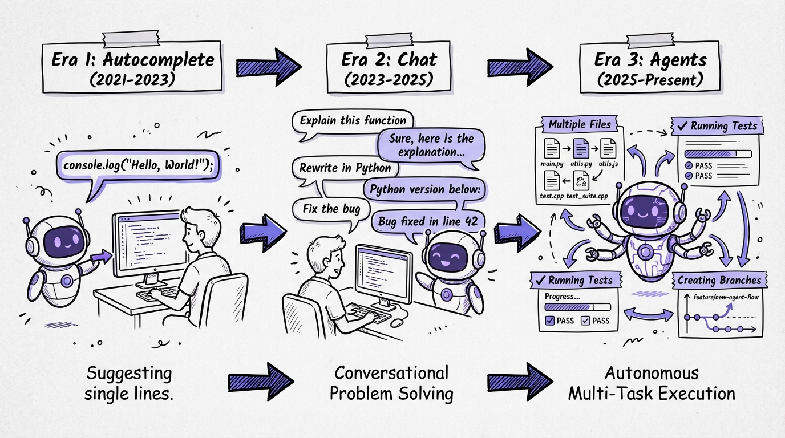
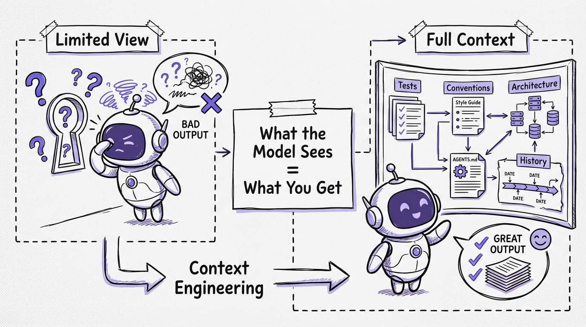
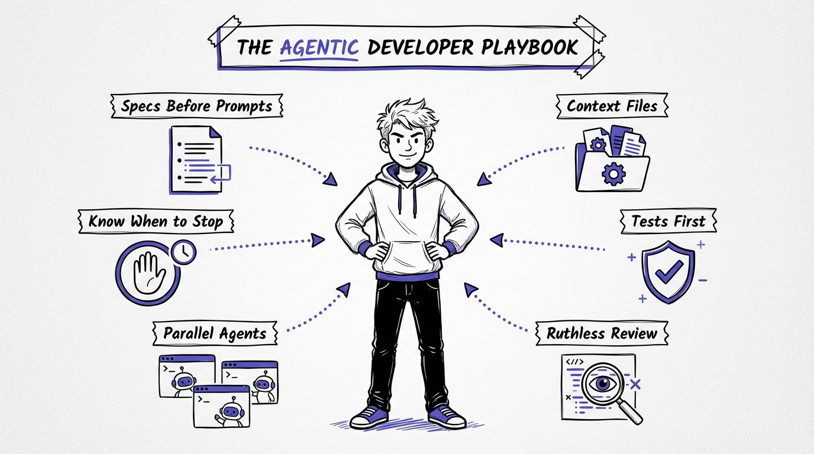

# Chapter 1: Software Development Has Changed

There's a moment most developers remember. Maybe it was the first time GitHub Copilot completed an entire function for you. Maybe it was the first time you described a feature in plain English and watched an agent write, test, and commit the code. Maybe it was the moment you realized you'd spent the last hour *reviewing* code instead of *writing* it.

Whatever the moment was, it split your career into before and after.

Software development has changed. Not in the way pundits predicted (no, developers are not obsolete), and not in the way skeptics hoped (no, this isn't just better autocomplete). It changed in a way that's both more subtle and more profound: the act of building software has shifted from writing code to directing the writing of code.

This chapter traces that shift. Not to rehash the history of AI for its own sake, but because understanding the trajectory tells you where to aim.

## The Three Eras

### Era 1: Autocomplete (2021-2023)

GitHub Copilot launched in June 2021, and at first, it was exactly what it looked like: fancy autocomplete. You'd type a function signature, and it would suggest a body. You'd write a comment, and it would generate matching code. Useful? Absolutely. Transformative? Not yet.

The autocomplete era had a clear interaction model. You drove. The AI rode shotgun. It could suggest the next few lines, but it had no understanding of your project, your architecture, or your intent beyond the immediate file. It operated on a single-file context window, and that context window was small.

GitHub's own research during this period showed that developers using Copilot completed 26% more tasks per week. Meaningful, but incremental. You were still writing code. You just had a fast typist looking over your shoulder.

The mental model was simple: AI helps you type faster. Your job didn't change. Your skills didn't change. You just had a productivity boost on the mechanical parts of coding.

### Era 2: Chat and Inline Assistance (2023-2025)

Then came ChatGPT, and with it, a different interaction model. Instead of autocomplete, you had a conversation. You could describe a problem and get a solution. You could paste an error message and get a diagnosis. You could ask "how does OAuth 2.0 work?" and get an explanation tailored to your codebase.

This era introduced chat panels in IDEs. Copilot Chat. Cursor's chat interface. Cody. The interaction model shifted from "complete my line" to "answer my question" and eventually to "edit this code for me."

The productivity gains were real but uneven. Developers who were already strong could use chat as a high-bandwidth rubber duck: a thinking partner that happened to know every framework and library. But developers who were struggling often got worse. They'd accept generated code they didn't understand, introducing bugs they couldn't debug.

This era also surfaced a critical insight that would define everything that followed: the quality of the output was directly proportional to the quality of the input. Vague questions got vague answers. Specific, well-structured prompts got excellent code. The skill wasn't "using AI." The skill was communicating precisely.

### Era 3: Agents (2025-Present)

In 2025, the interaction model changed again, and this time the change was fundamental. The AI stopped being a tool you used and started being an agent you directed.

The difference matters. A tool does what you tell it, one step at a time. An agent takes a goal, breaks it into steps, executes them, observes the results, and adjusts. Agent mode in Copilot, Cursor, and Windsurf didn't just suggest code. It could:

- Read multiple files across your codebase
- Run your tests and see the output
- Execute terminal commands
- Create and delete files
- Iterate on its own work based on errors

Then came the CLI agents: Claude Code, Codex CLI. These operated directly in your terminal, with access to your full development environment. They could grep your codebase, run your build, execute your test suite, and iterate until things worked.

Then came background agents: GitHub Copilot Coding Agent, Codex Cloud, Google Jules. These didn't even need your IDE open. You could assign a task from your phone, and the agent would create a branch, write the code, run the tests, and open a pull request for your review.

Andrej Karpathy, who coined "vibe coding" in February 2025, evolved his terminology by February 2026 to "agentic engineering," calling it "a serious engineering discipline involving autonomous agents." The casual, throw-a-prompt-and-see-what-happens era was over.

## What Actually Changed

The shift from autocomplete to agents isn't just a feature upgrade. It changed the fundamental economics of software development.

### Writing Code Became Cheap

This is the hardest thing for experienced developers to internalize. For your entire career, the scarce resource was the ability to translate ideas into working code. That's what companies paid for. That's what made you valuable.

Writing code is no longer the bottleneck. An agent can generate hundreds of lines of working code in seconds. The GitHub/Microsoft study found that Copilot users completed 26% more tasks, effectively turning an 8-hour day into 10 hours of output. At scale, GitHub reported up to 81% productivity improvement among active Copilot users. Over a million pull requests were created by agents between May and September 2025 alone.

The raw production of code is cheap and getting cheaper.

### Reading Code Became Expensive

Here's what nobody talks about enough: as code generation gets cheaper, code *review* gets more expensive. Not in dollars, but in cognitive load.

When an agent generates 200 lines of code in 30 seconds, someone has to verify that those 200 lines are correct, secure, performant, and maintainable. That someone is you. And reviewing code you didn't write is harder than reviewing code you did write, because you don't have the mental model of the decisions that were made along the way.

Addy Osmani, engineering lead on Google Chrome and author of *Beyond Vibe Coding*, put it precisely: "You're trading typing time for review time, implementation effort for orchestration skill, writing code for reading and evaluating code."

This is the new trade. And it's not a bad one. But it requires different skills than most developers have spent their careers building.

### Specification Became the Product

In the agent era, the specification IS the work. A vague request like "build me a REST API for user management" will produce code. It will compile. It might even pass basic tests. But it will be riddled with assumptions you didn't intend, patterns you didn't want, and edge cases you didn't consider.

A precise specification, one that defines the endpoints, the data model, the error handling behavior, the authentication scheme, the test scenarios, and the architectural constraints, will produce code that's genuinely useful. Often better than what you'd have written by hand, because the agent can apply patterns consistently across an entire codebase without fatigue or distraction.

Simon Willison, one of the most prolific practitioners of agentic development, made this observation: "Code that started from your own specification is a lot less effort to review." That's the key insight. The spec isn't just input to the agent. It's input to your future self, the reviewer.

### Context Became King

The single biggest differentiator between developers who thrive with agents and those who struggle is context engineering. Not prompting. Context engineering.

Prompting is what you type into the chat box. Context engineering is everything else: the files that tell the agent about your project, the rules that guide its behavior, the architectural decisions documented in markdown, the test suite that validates its output, and the codebase itself.

Bharani Subramaniam from ThoughtWorks defined it simply: "Context engineering is curating what the model sees so that you get a better result."

The developers who are genuinely faster with AI agents have invested in making their codebases legible to agents. They have context files that explain their conventions. They have comprehensive test suites that catch mistakes. They have clear architectural boundaries that prevent agents from making cross-cutting changes they shouldn't. They haven't just adopted tools. They've adapted their entire development environment.

## The Uncomfortable Truth

Let's be honest about something. Most developers are in a weird middle ground right now. They're using AI tools. They have Copilot or Cursor or Claude Code installed. They use them daily. And many of them are getting worse, not better.

The METR study (which we'll dig into deeply in the next chapter) found that experienced developers were 19% slower with AI tools on familiar codebases. But they *perceived* themselves to be 20% faster. That's not a small discrepancy. That's a 39-percentage-point gap between perception and reality.

This happens because AI tools are seductive in a very specific way. They remove the *feeling* of effort. When an agent writes 200 lines of code for you, it feels like you accomplished something. When you then spend 45 minutes debugging a subtle issue the agent introduced, that feels like a separate problem, not an AI problem. The human brain doesn't naturally attribute the debugging time back to the generation that caused it.

The result is that most developers are in what I call the "productivity illusion": using AI tools, feeling productive, and actually being less effective than they would be without them.

This book exists to get you out of that illusion and into genuine, measurable productivity gains.

## What the Best Developers Are Doing Differently

The developers who are genuinely thriving with agents, the ones who are 2-3x more productive, not 19% slower, share a set of practices. These practices are the subject of this entire book, but here's the preview:

**They write specs before prompts.** They don't start with "build me a thing." They start with a design document, a set of requirements, or at minimum a detailed description of what they want. The spec becomes the prompt.

**They invest in context files.** Their projects have AGENTS.md or CLAUDE.md files that tell agents how the project works. Coding conventions, architecture decisions, build commands, testing frameworks. This context makes every agent interaction better.

**They write tests first.** This is the single highest-leverage practice. When you have a comprehensive test suite, you can let an agent iterate freely because the tests catch mistakes automatically. The agent writes code, runs the tests, fixes failures, and repeats. You review the final result, not every intermediate step.

**They review ruthlessly.** They don't accept generated code at face value. They read it with the same (or greater) scrutiny they'd apply to a pull request from a junior developer. They question architectural decisions. They check edge cases. They verify security implications.

**They work in parallel.** Following Simon Willison's "parallel coding agent lifestyle," they run multiple agents simultaneously on different tasks. One agent researches a library, another fixes a bug, a third implements a feature. The developer orchestrates and reviews.

**They know when to stop.** They recognize when an agent is going in circles, when the task is better done by hand, and when the cost of context-switching to agent mode exceeds the benefit. Not every task should be agentic.

## The Anthropic Forecast

Anthropic's 2026 Agentic Coding Trends Report identified eight trends reshaping software development. The first is the most relevant: a "tectonic shift in the SDLC" where engineers move from writing code to agent supervision, system design, and output review.

This isn't a future prediction. This is a description of what's already happening at companies that have adopted agentic workflows seriously. Engineers are spending less time in editors and more time in specifications and reviews. They're writing less code and reading more code. They're making fewer keystrokes and more decisions.

The report also notes that agents are becoming "team players," coordinating with each other in multi-agent systems. One agent handles the API layer, another handles the frontend, a third writes tests, and an orchestrator manages the coordination. This is no longer science fiction. It's available today in tools like Claude Code's sub-agent system and the ComposioHQ agent-orchestrator.

## What This Means For You

If you're reading this, you're probably in one of three positions:

**You're skeptical.** You've tried AI tools, found them overhyped, and gone back to writing code the old way. The METR study probably validates your experience. And you're right: naive AI tool use *does* hurt. But disciplined agentic development is a different thing entirely. Give this playbook a chance. The workflows here are nothing like "ask ChatGPT to write your code."

**You're enthusiastic but frustrated.** You use AI tools every day but the results are inconsistent. Sometimes the agent nails it. Sometimes it produces garbage. You can't figure out the pattern. The pattern is context. Chapter 4 of this playbook will change how you think about it.

**You're already in.** You've adopted agentic workflows and you're looking to sharpen your technique. You want the specific patterns, the templates, the workflows that separate good from great. That's what the TDD Agent Loop chapter (and the full book) deliver.

Wherever you're starting from, here's the promise: by the end of this playbook, you'll understand the shift, you'll know why disciplined technique matters, and you'll have a concrete, battle-tested workflow you can start using immediately.

Software development has changed. The question isn't whether to adapt. It's how fast.
