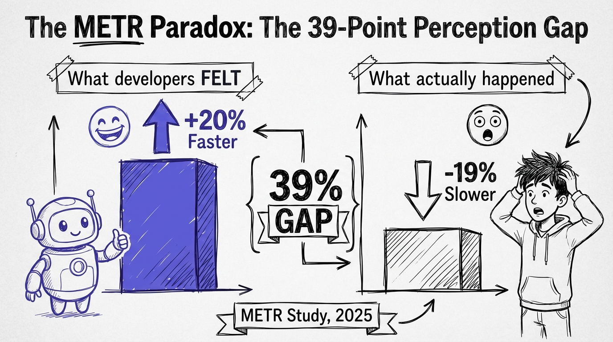

# Chapter 2: The METR Paradox

In July 2025, a research organization called METR published a study that should have been a wake-up call for every developer using AI tools. It wasn't. Most people either ignored it, dismissed it, or cherry-picked the parts that confirmed what they already believed.

Here's what the study found: experienced open-source developers working on codebases they knew well were **19% slower** when using AI tools compared to working without them.

Let that land for a second. Not beginners. Experienced developers. Not unfamiliar codebases. Repositories they had contributed to, understood deeply, and navigated daily. The AI tools didn't help them. The tools actively slowed them down.

But here's the part that turns this from an interesting finding into something genuinely unsettling: those same developers **believed they were 20% faster**.

That's a 39-percentage-point gap between perception and reality. And it tells us something critical about the current state of AI-assisted development that no amount of marketing from tool vendors will address.

## The Study

The METR study (published as a preprint on arXiv) was rigorous in ways that most AI productivity claims are not. They didn't survey developers about how they felt. They measured actual task completion times. Experienced open-source contributors worked on real issues in repositories they maintained, with and without AI assistance, in a controlled setting.

The tasks were representative: bug fixes, feature implementations, refactoring. Real work, not coding challenges or toy problems. The kind of tasks that make up a developer's actual week.

And the result was clear. AI tools slowed these developers down.

## Why AI Makes Experts Slower (When Used Naively)

The finding sounds counterintuitive until you think about what actually happens when an experienced developer uses an AI tool on familiar code.

### The Context Switch Tax

When you know a codebase deeply, you have a rich mental model. You know where things are. You know why decisions were made. You know the hidden constraints that aren't documented anywhere. You can hold the relevant context in your head and write code that fits the system like a puzzle piece.

When you introduce an AI agent into this workflow, you're adding a context switch. Instead of writing code directly from your mental model, you now have to:

1. Translate your mental model into a prompt
2. Wait for the agent to generate code
3. Read the generated code
4. Compare it against your mental model
5. Identify discrepancies
6. Decide whether to fix the code or regenerate
7. Often, just rewrite it yourself anyway

For an expert working on familiar code, steps 1-6 take longer than just writing the code. The agent doesn't have your mental model. It doesn't know about the conversation you had with a teammate three months ago that explains why the authentication middleware is structured that way. It doesn't know that the seemingly redundant null check exists because of a specific edge case in production.

### The Illusion of Progress

So why did these developers *think* they were faster? Because AI tools create a compelling illusion of productivity.

When an agent generates 50 lines of code in two seconds, your brain registers that as "I just did 50 lines of work." It feels fast because the *visible output* appeared fast. The invisible work, reading it, verifying it, fixing the three subtle issues, adjusting the approach when it doesn't quite fit, all gets mentally filed under "normal development work," not "overhead from using AI."

This is a well-documented cognitive bias. Humans are bad at attributing effort to the right cause, especially when the cause and the effort are separated in time. The generation feels instant. The debugging happens ten minutes later. Your brain doesn't connect them.

### The Sunk Cost Trap

There's another dynamic at play. When an agent generates a large block of code, developers feel reluctant to throw it away. They've invested time in crafting the prompt, waiting for the response, and reading the output. Even when the code isn't quite right, there's a pull to "fix it up" rather than start fresh.

This is almost always the wrong choice. Fixing AI-generated code that doesn't match your mental model takes longer than writing correct code from scratch. But the sunk cost makes it feel wasteful to discard it.

## The Other Side of the Data

Now, the METR study has important boundary conditions that matter enormously.

The study measured experienced developers on *familiar* codebases. This is a very specific scenario. And it's not the only scenario that matters.

Other studies paint a different picture for different contexts:

**GitHub's research** found that developers using Copilot completed 26% more tasks. The key difference: this included unfamiliar tasks and greenfield work, exactly the contexts where you *don't* have a deep mental model to draw on.

**Individual developer output** studies show 20-40% productivity increases when AI tools are used across a mix of familiar and unfamiliar work.

**GitHub's scale data** showed up to 81% productivity improvement among active Copilot users, measured across over a million pull requests created between May and September 2025.

So the full picture isn't "AI tools don't work." It's more nuanced and more useful:

- **AI tools hurt experts on familiar code** (when used naively)
- **AI tools help everyone on unfamiliar code** and greenfield work
- **AI tools help most on boilerplate, repetitive, and mechanical tasks**
- **The gap between "helps" and "hurts" is technique**

That last point is the one that matters for this book.

## The Discipline Gap

Here's the paradox, stated cleanly: the same tools that make naive users slower make disciplined users dramatically faster. The variable isn't the tool. It's the technique.

What does disciplined use look like? It looks like the practices we'll cover throughout this book:

### 1. Knowing When to Use Agents (And When Not To)

The developers who are genuinely more productive have developed an intuition for when an agent will help and when it will hurt. Rules of thumb:

**Use an agent when:**
- You're working in an unfamiliar part of the codebase
- The task is boilerplate-heavy (CRUD endpoints, data models, configuration)
- You need to implement a well-known pattern (repository pattern, middleware, API versioning)
- You're exploring a new library or framework
- The task is well-specified and test-coverable

**Don't use an agent when:**
- You can write the code faster than you can describe it
- The task requires deep knowledge of hidden constraints
- You're in a flow state and the code is flowing naturally
- The change is tiny (a one-line fix where you already know the line)

The METR developers didn't make this distinction. They used AI tools across the board, including on tasks where their expertise was the fastest path.

### 2. Investing in Context

The METR study participants used AI tools with minimal context engineering. They didn't have AGENTS.md files explaining their project conventions. They didn't have comprehensive test suites that could validate agent output automatically. They didn't provide architectural constraints or coding standards.

They did what most developers do: opened the agent, typed a prompt, and hoped for the best.

Disciplined agentic development looks nothing like that. It looks like a carefully engineered context stack (which we cover in Chapter 4) that gives the agent enough information to produce useful output on the first try.

### 3. Writing Tests First

This is the single biggest differentiator. When you have tests, you can let an agent iterate autonomously. It writes code, runs the tests, sees failures, and fixes them. The feedback loop is tight and automatic.

Without tests, you're the feedback loop. You read every line, evaluate every decision, and catch every bug manually. That's slow. That's what the METR developers were doing.

The TDD Agent Loop (Chapter 5 in this playbook) is designed specifically to address this. It's the workflow that turns the METR paradox on its head.

### 4. Reviewing Like an Architect

Disciplined developers don't just check if the code "works." They review agent output the way a senior architect reviews a pull request:

- Does this fit the existing patterns in the codebase?
- Are there security implications?
- How will this perform at scale?
- Is this maintainable by a human who hasn't seen the prompt?
- What's the test coverage?

This kind of review is a skill. It's learnable. And it's far more valuable than the ability to type code fast.

## The GitClear Warning

While we're looking at data, one more study deserves attention. GitClear's 2025 analysis found a **4x growth in code clones** in repositories using AI assistants. That is, copied or near-identical code blocks appearing throughout codebases.

This is the quality side of the equation. Even when AI tools make you *faster* (in terms of task completion), they can make your codebase *worse*. Agents don't refactor. They don't say "this pattern already exists in your utility library, let me reuse it." They generate fresh code for every request, and that code often duplicates existing functionality.

Disciplined developers catch this during review. They look for duplication, unnecessary abstractions, and code that should have been a function call instead of a reimplementation. Undisciplined developers accept the output and move on, accumulating technical debt at 4x the normal rate.

## The Real Lesson

The METR study isn't an argument against AI tools. It's an argument against naive AI tool use. And the distinction matters enormously.

Naive use: open the agent, type a prompt, accept the output, move on.

Disciplined use: engineer the context, write the tests, craft the specification, let the agent work within constraints, review the output thoroughly, iterate when needed, and know when to do the work by hand.

The gap between these two approaches is the gap between being 19% slower and being 2-3x faster. It's the gap between thinking you're productive and actually being productive.

This is why Addy Osmani observed that "AI-assisted development actually rewards good engineering practices MORE than traditional coding does." The better your specs, the better the AI's output. The more comprehensive your tests, the more confidently you can delegate. The cleaner your architecture, the less likely the agent is to introduce inconsistencies.

Good engineering practices were always valuable. In the agent era, they're *essential*.

## Your Calibration Check

Before moving on, try this exercise. Think about the last week of your development work. For each task where you used an AI tool, ask:

1. Was I actually faster, or did it just *feel* faster?
2. How much time did I spend debugging or fixing AI-generated code?
3. Did I accept any code I didn't fully understand?
4. Would I have been faster writing it by hand?

Be honest. The METR developers weren't, and the 39-percentage-point gap between their perception and reality is the proof.

If you find that AI tools are genuinely saving you time, great. You're probably already practicing some of the discipline this book teaches. Sharpen it further.

If you find that the tools might be creating a productivity illusion, that's not a failure. It's awareness. And awareness is the first step to the transformation the rest of this book provides.

The paradox is real. But it's solvable. That's what the next chapters are for.
