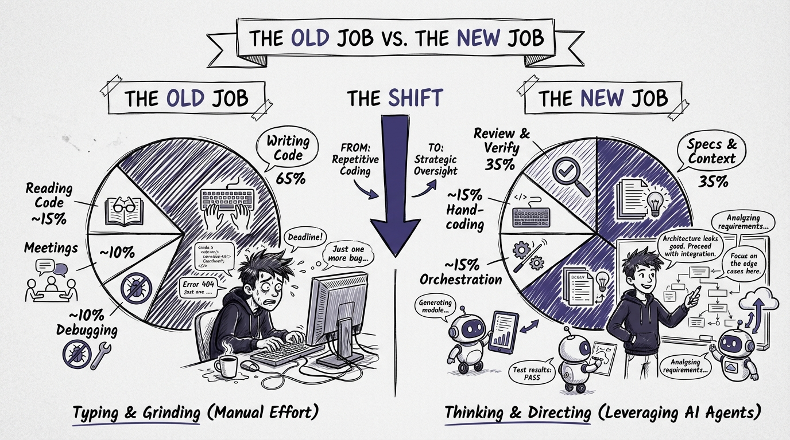

# Chapter 3: Your New Job Description

If you've internalized the first two chapters, you're sitting with an uncomfortable realization: the thing you've spent years getting good at (writing code) is no longer the primary thing your job demands.

That doesn't mean your skills are useless. It means they've been *promoted*. Everything you know about software architecture, system design, debugging, testing, and code quality is more valuable than ever. You just apply it differently now.

Addy Osmani captured this precisely: "Agentic engineering disproportionately benefits senior engineers." The more you know about building software, the better you are at directing agents to build it. Your experience isn't obsolete. It's your competitive advantage.

But the day-to-day work looks different. Let's define what the job actually is now.

## The Old Job vs. The New Job



### What You Used to Do

A typical day for a senior developer in 2023 looked something like this:


- **Morning:** Read through open PRs, leave comments, merge what's ready
- **Mid-morning:** Pick up a ticket, read the requirements, start coding
- **Afternoon:** Write implementation code, debug issues, write tests
- **Late afternoon:** More implementation, maybe a design discussion
- **End of day:** Push code, update the ticket, plan tomorrow

The core activity: translating requirements into code. You spent maybe 60-70% of your time writing or editing code, 20% reading code, and 10% on everything else.

### What You Do Now

A typical day for an effective agentic developer in 2026:


- **Morning:** Review PRs from overnight background agents, approve or send back with notes
- **Mid-morning:** Write specs for the day's work, break features into agent-sized tasks
- **Late morning:** Launch agents on 3-4 tasks in parallel, review first results
- **Afternoon:** Architecture decisions on edge cases agents flagged, review more output, refine context files based on patterns you see
- **Late afternoon:** Final reviews, integration testing, context file updates for tomorrow
- **End of day:** Queue up background agent tasks for overnight work

The core activity: specification, review, and orchestration. You spend maybe 20% of your time writing code by hand, 40% reviewing agent output, and 40% on specs, architecture, and context engineering.

That's not a small shift. That's a fundamentally different job.

## The Five New Skills


The transition from code-writer to agentic developer requires five skills that most developers haven't deliberately practiced. They're all learnable. Some of them you already have in embryonic form.

### 1. Context Engineering

This is the big one. Chapter 4 of this playbook goes deep on it, so here's the short version: context engineering is the skill of curating what the agent sees so that it produces better results.

It includes:

- Writing and maintaining AGENTS.md or CLAUDE.md files
- Creating path-scoped rules for different parts of your codebase
- Designing your codebase to be AI-readable (clear naming, good structure, documented decisions)
- Knowing what context to include and, crucially, what to exclude
- Building and maintaining a test suite that serves as automated verification

This skill didn't exist two years ago. It's now the most important skill in your toolkit. The developers who are 2-3x more productive with agents are, almost without exception, excellent context engineers.

### 2. Specification Writing

Remember when "writing good requirements" was something PMs did and developers complained about? Now it's your core deliverable.


When you direct an agent, your specification IS the work. The more precise your spec, the better the output. The more ambiguous your spec, the more time you spend on review and rework.

Good specs for agents look like this:

```markdown
## Task: Add rate limiting to the API

### Requirements
- Apply rate limiting to all endpoints under /api/v1/
- Use a sliding window algorithm with a 60-second window
- Default limit: 100 requests per window per API key
- Return 429 Too Many Requests with a Retry-After header when exceeded
- Rate limit state stored in Redis (use the existing IDistributedCache)
- Bypass rate limiting for requests with the X-Internal-Service header

### Constraints
- Do NOT modify the existing middleware pipeline ordering
- Use the existing ApiKey from the request context (HttpContext.Items["ApiKey"])
- Follow the existing middleware pattern in src/Api/Middleware/

### Test Scenarios
- Request within limit returns 200
- Request exceeding limit returns 429 with correct Retry-After value
- Rate limit resets after window expires
- Internal service header bypasses rate limit
- Different API keys have independent limits
```

Compare that to: "Add rate limiting to the API." Same task. Vastly different output quality.

The spec isn't just for the agent. As Simon Willison observed, "Code that started from your own specification is a lot less effort to review." When you wrote the spec, you already know what the code *should* do. Reviewing becomes verification, not exploration.

### 3. Architectural Thinking

When agents write most of the code, the decisions that remain with you are the ones that matter most: the architectural decisions.

Which patterns to use. How to structure the project. Where to draw service boundaries. How data flows through the system. What trade-offs to make between complexity and flexibility. These are the decisions agents can't make well because they require understanding the full business context, the team's capabilities, the deployment constraints, and the long-term evolution of the system.

This is why Osmani says agentic engineering benefits senior engineers disproportionately. A junior developer can write a prompt. A senior developer can write a prompt *and* evaluate whether the resulting architecture will hold up under load, scale with the team, and survive the next three requirements changes.

If you've been coding for years and feel like your "just typing code" skills are becoming less valuable, here's the reframe: your architectural judgment is becoming *more* valuable. It's the thing agents can't replicate.

### 4. Code Review (At Scale)

You've done code review before. But you probably haven't done it at the volume and velocity that agentic development demands.

When you're running 3-5 agents in parallel (which is the workflow Simon Willison describes and we cover in the full book), you might review 10-20 substantial code changes in a single day. That's more review than most developers do in a week.

This requires a different approach than the leisurely PR review you're used to. You need:

**A triage system.** Not every agent output needs the same level of scrutiny. A boilerplate CRUD endpoint needs a quick scan. A security-sensitive authentication change needs line-by-line review. Develop a sense for what's high-risk and what's routine.

**Pattern recognition.** After reviewing hundreds of agent outputs, you'll start recognizing common failure modes: unnecessary abstractions, duplicated logic, missing edge cases, overly complex solutions to simple problems. Your review speed increases as your pattern library grows.

**Automated guardrails.** You shouldn't be the only line of defense. Comprehensive test suites, linting rules, static analysis, and CI pipelines catch the mechanical issues. Your review focuses on the things machines can't catch: architectural fit, business logic correctness, and long-term maintainability.

**The "would I approve this PR from a junior developer?" test.** If the answer is "I'd send it back with comments," don't accept it from the agent either. Your quality bar doesn't change just because the code was free to produce.

### 5. Agent Orchestration

This is the meta-skill: knowing how to break work into pieces that agents can handle effectively, when to run agents in parallel versus sequentially, when to intervene versus let the agent iterate, and when to do the work yourself.

Good orchestration looks like:

- **Decomposing a feature** into 4-5 independent tasks that agents can work on simultaneously
- **Ordering dependent work** so that agent A's output feeds into agent B's context
- **Recognizing stuck agents** early and redirecting instead of letting them burn tokens going in circles
- **Switching tools** based on the task (CLI agent for terminal work, IDE agent for multi-file edits, background agent for overnight tasks)

Bad orchestration looks like:

- Giving an agent a vague, multi-day task and hoping for the best
- Running agents sequentially when they could work in parallel
- Spending 30 minutes crafting a prompt for a task you could code in 10 minutes
- Accepting agent output without review because "it generated fast, it must be right"

## The Emotional Shift

Let's talk about something the technical literature ignores: this transition can feel terrible.

If you've spent 10+ years becoming an excellent code-writer, it can feel like the ground shifted under you. The thing you're great at is still useful, but it's no longer the main thing. That's disorienting. It can feel like a demotion even though it's objectively a promotion.

Here's the reframe that helped me: you're not losing the coding skill. You're adding skills on top of it. An architect who can also code is more valuable than an architect who can't. A reviewer who understands implementation deeply catches things a non-coding reviewer misses. Your coding skill makes you a *better* agentic developer, not an obsolete one.

The developers who struggle most with this transition are the ones who define their identity by their typing speed, their ability to hold an entire system in their head, or their pride in "doing it myself." These are all legitimate sources of professional pride. They're just no longer sufficient on their own.

The developers who thrive are the ones who redefine their identity around *outcomes*: shipping working software, making good architectural decisions, maintaining high code quality, and enabling their team (human and AI) to do their best work.

## The 80/20 of Agentic Development


If you do nothing else after reading this playbook, do these three things. They account for roughly 80% of the productivity gains:

### 1. Create a Context File for Your Project

Even a simple AGENTS.md with your build commands, testing framework, coding conventions, and architectural decisions will dramatically improve agent output. Chapter 4 shows you exactly how. This takes 30 minutes and pays off on every single agent interaction going forward.

### 2. Write Tests Before Prompting

When you have tests, agents can self-correct. Without tests, you're the test suite. Chapter 5 walks through the TDD Agent Loop in detail. This single workflow change is responsible for the majority of productivity gains in my experience.

### 3. Spec Your Tasks

Before you prompt an agent, spend 5 minutes writing a clear specification. What should this code do? What are the constraints? What are the test scenarios? This small upfront investment saves 30+ minutes of review and rework on the other end.

These three practices, context files, tests first, and specs, are the foundation. Everything else in this book builds on them.

## The 30-Day Horizon

Anthropic's report says developers now use AI in 60% of their work. That number is climbing. Within a year, developers who haven't adopted agentic workflows will be the exception, not the norm.

But here's the good news: this isn't a years-long transformation. The full book includes a 30-day plan (Chapter 29) that takes you from wherever you are today to a fully operational agentic workflow. The core skills, context engineering, specification writing, and the TDD agent loop, can be learned and practiced in weeks, not months.

You don't need to change everything at once. Start with the three practices above. Add context engineering depth as you go. Experiment with parallel agents when you're comfortable with single-agent workflows. Build toward the full agentic development lifecycle at your own pace.

The job has changed. But the new job is learnable, valuable, and honestly, more interesting than the old one. You make more decisions, solve harder problems, and ship more software. You just do less typing.

That's a trade worth making.
