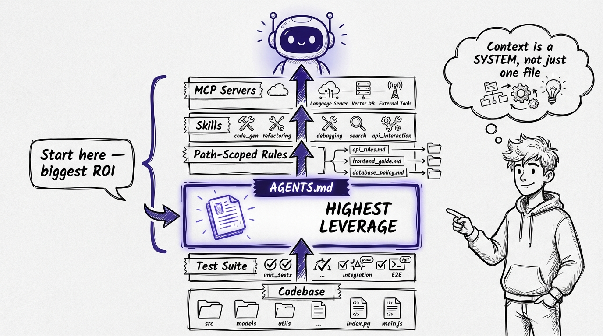
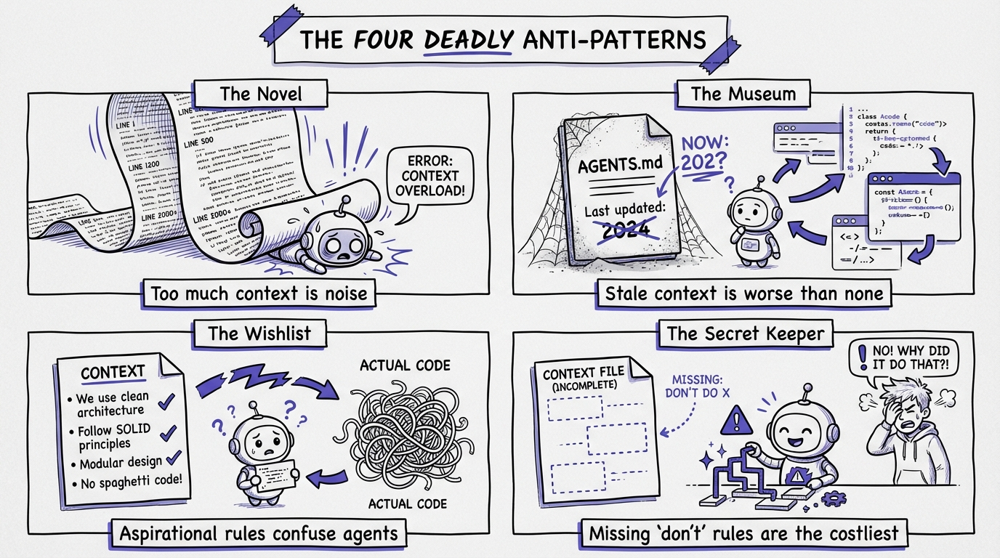
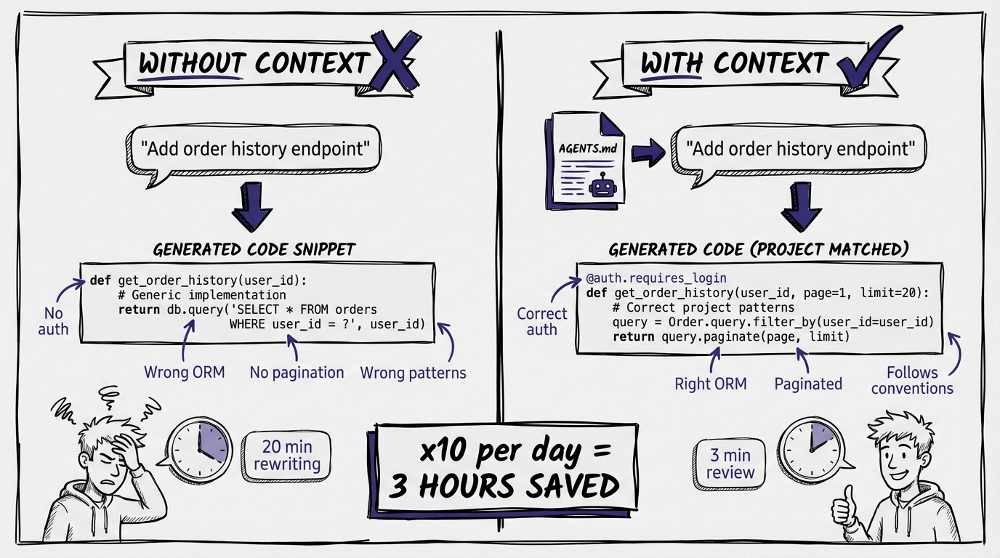

# Chapter 4: Writing Effective Context Files

*This is Chapter 6 in the full book.*

If you take one thing from this entire playbook, make it this: **context engineering is the single most important skill in agentic development.** Not prompting. Not tool selection. Not model choice. Context.

Bharani Subramaniam from ThoughtWorks defined it simply: "Context engineering is curating what the model sees so that you get a better result." That sounds abstract. In practice, it's concrete and mechanical. It's the set of files, rules, and conventions that tell your agent how to work with your specific project.

The developers who are 2-3x more productive with agents all have one thing in common: they've invested in context. They didn't just install the tool and start prompting. They built an information layer that makes every agent interaction better.

This chapter gives you the system. Templates, examples, and the reasoning behind every decision.

## The Context Stack



Modern AI coding agents load context from multiple layers. Understanding these layers tells you where to invest your effort.

| Layer | What It Does | When It Loads | Your Time Investment |
|-------|-------------|--------------|---------------------|
| **AGENTS.md / CLAUDE.md** | Always-on project guidance | Automatically, every session | High (create once, maintain ongoing) |
| **Path-scoped rules** | Modular guidance for specific file types | When matching files are open | Medium (add as patterns emerge) |
| **Skills** | On-demand instructions and scripts | When the agent decides they're relevant | Low to medium |
| **MCP servers** | External tool and data access | When the agent needs external info | Setup cost, then low |
| **The codebase itself** | Your existing code IS context | Always | Ongoing (it's your normal work) |
| **Test suite** | Automated verification of agent output | When agent runs tests | High (but you should have this anyway) |

The highest-leverage investment is the first row: your main context file. Everything else builds on it.


## The Main Context File: AGENTS.md

There's an emerging standard called AGENTS.md (documented at agents.md). GitHub Copilot uses `copilot-instructions.md`. Cursor uses `.cursorrules`. Claude Code uses `CLAUDE.md`. The format varies but the concept is identical: a markdown file at the root of your project that tells agents how to work here.

I recommend using AGENTS.md because it's the most tool-agnostic, but the content matters more than the filename. Write it once and symlink or copy to tool-specific filenames if you need to.

### What Goes In It

Your context file answers one question: "What does an agent need to know to write good code in this project?" Not everything about the project. Just the things that affect code quality.

Here's the structure I use, section by section.

### Template: The Complete AGENTS.md

```markdown
# AGENTS.md

## Project Overview
Brief description of what this project does. 2-3 sentences max.
Not a README. Just enough for the agent to understand scope.

## Tech Stack
- Runtime: .NET 9 / ASP.NET Core
- Database: PostgreSQL via EF Core
- Cache: Redis via IDistributedCache
- Message queue: RabbitMQ via MassTransit
- Auth: JWT bearer tokens with ASP.NET Identity
- Testing: xUnit + FluentAssertions + NSubstitute
- CI: GitHub Actions

## Build & Run
```bash
# Restore and build
dotnet build

# Run tests
dotnet test

# Run the API (requires Docker for dependencies)
docker compose up -d
dotnet run --project src/Api
```

## Project Structure
```
src/
  Api/              # ASP.NET Core Web API (entry point)
  Domain/           # Domain entities and interfaces
  Infrastructure/   # EF Core, external services, repositories
tests/
  Api.Tests/        # Integration tests
  Domain.Tests/     # Unit tests
```

## Coding Conventions
- Use file-scoped namespaces
- Use primary constructors for DI
- Records for DTOs, classes for entities
- No regions. Ever.
- Keep methods under 30 lines. Extract if longer.
- Async all the way down. No .Result or .Wait().

## Architecture Patterns
- Vertical slice architecture: each feature is a self-contained folder
- CQRS with MediatR: commands and queries as separate types
- Repository pattern for data access (no direct DbContext in handlers)
- Result pattern for error handling (no exceptions for business logic)

## Error Handling
- Return Result<T> from handlers, not exceptions
- Map Result failures to HTTP status codes in the controller
- Use ProblemDetails for all error responses
- Log errors in middleware, not in handlers

## Testing Conventions
- One test class per feature/handler
- Use the builder pattern for test data (see tests/Builders/)
- Integration tests use WebApplicationFactory with a real database
- Name tests: MethodName_Scenario_ExpectedResult

## What NOT to Do
- Do NOT use AutoMapper (we use manual mapping methods)
- Do NOT add NuGet packages without asking
- Do NOT modify the middleware pipeline in Program.cs without asking
- Do NOT use static methods for business logic
- Do NOT write console output (use ILogger)

## API Conventions
- RESTful routes: /api/v1/{resource}
- Use [FromRoute], [FromQuery], [FromBody] explicitly
- Return ActionResult<T> from controllers
- POST returns 201 with Location header
- All endpoints require [Authorize] unless explicitly noted
```

That's a real context file. It's opinionated, specific, and actionable. An agent reading this file knows how to write code that fits this project. Without it, the agent guesses, and its guesses are generic.


### Why Each Section Matters

**Project Overview:** Agents make better decisions when they understand what they're building. A payments API and a chat application have different quality concerns.

**Tech Stack:** Prevents the agent from suggesting libraries you don't use. Without this, agents will happily suggest Dapper when you use EF Core, or Moq when you use NSubstitute.

**Build & Run:** Agents (especially CLI agents like Claude Code) can execute these commands. If they can run your tests, they can self-correct. This is critical for the TDD loop.

**Project Structure:** Agents need to know where to put new files. Without this, they'll create files in random locations or follow whatever convention the training data suggests.

**Coding Conventions:** This is where your context file pays the highest dividends. Every convention you document is a convention the agent follows automatically instead of you catching it in review.

**Architecture Patterns:** Prevents the agent from fighting your architecture. If you use CQRS and the agent writes a handler that directly calls the database, you've wasted time. Document the pattern, and the agent follows it.

**What NOT to Do:** Arguably the most important section. Agents are biased toward the most common patterns in their training data. If the most common .NET pattern is to use AutoMapper but you don't, you need to say so explicitly. Negative constraints are as valuable as positive ones.

## Path-Scoped Rules

Your main context file handles project-wide conventions. Path-scoped rules handle the specifics of different areas of your codebase.

In Claude Code, these go in `.claude/rules/` with glob patterns. In Cursor, they go in `.cursor/rules/`. The concept is the same: rules that only apply when the agent is working with matching files.

### Example: Controller Rules

File: `.claude/rules/controllers.md`
Applies to: `src/Api/Controllers/**`

```markdown
# Controller Conventions

Controllers are thin. They do three things:
1. Validate the request (model binding + FluentValidation)
2. Send a command/query via MediatR
3. Map the result to an HTTP response

No business logic in controllers. No direct database access.
No try/catch (the global exception middleware handles errors).

## Template
```csharp
[ApiController]
[Route("api/v1/[controller]")]
[Authorize]
public class OrdersController(ISender sender) : ControllerBase
{
    [HttpGet("{id:guid}")]
    public async Task<ActionResult<OrderResponse>> Get(Guid id)
    {
        var result = await sender.Send(new GetOrderQuery(id));
        return result.Match<ActionResult<OrderResponse>>(
            success => Ok(success),
            notFound => NotFound()
        );
    }
}
```
```

### Example: Test Rules

File: `.claude/rules/tests.md`
Applies to: `tests/**`

```markdown
# Testing Conventions

Use xUnit, FluentAssertions, NSubstitute. No other test libraries.

## Unit Tests
- Test one behavior per test method
- Use Arrange/Act/Assert structure (with blank line separators)
- Use NSubstitute for mocking interfaces, never concrete classes
- Test name format: MethodName_Scenario_ExpectedResult

## Integration Tests
- Use WebApplicationFactory<Program>
- Each test class creates its own test database
- Seed data using builder pattern (see tests/Builders/)
- Always dispose/clean up database after test class

## Example
```csharp
public class CreateOrderHandlerTests
{
    private readonly IOrderRepository _repository = Substitute.For<IOrderRepository>();
    private readonly CreateOrderHandler _handler;

    public CreateOrderHandlerTests()
    {
        _handler = new CreateOrderHandler(_repository);
    }

    [Fact]
    public async Task Handle_ValidOrder_ReturnsCreatedResult()
    {
        // Arrange
        var command = new CreateOrderCommand("SKU-001", 2);

        // Act
        var result = await _handler.Handle(command, CancellationToken.None);

        // Assert
        result.IsSuccess.Should().BeTrue();
        await _repository.Received(1).AddAsync(Arg.Any<Order>());
    }
}
```
```

### When to Add Path-Scoped Rules

Don't create them all upfront. Add them reactively:

1. Agent writes code in a specific area that doesn't follow your conventions
2. You correct it during review
3. You add a rule so it doesn't happen again

This is the "build context files gradually" principle that experts recommend. Start with the main AGENTS.md. Add scoped rules as patterns emerge. Over a few weeks, your context layer becomes comprehensive.

## Context File Anti-Patterns



I've seen developers torpedo their own context engineering in a few predictable ways.

### The Novel

A 2,000-line context file that documents every class, every method, every database table. This is counterproductive. Models degrade with too much context. Keep your context file focused on conventions and decisions, not documentation. If the agent needs to understand a specific class, it can read the source code.

**Rule of thumb:** Your AGENTS.md should be under 200 lines. If it's longer, you're documenting your codebase, not your conventions.

### The Museum

A context file that was written once and never updated. Your project evolves. Your conventions evolve. When you add a new pattern, update the context file. When you change a convention, update the context file. A stale context file produces stale code.

**Practice:** Review your context file every two weeks. Does it still reflect how you actually work? Update what's changed. Remove what's obsolete.

### The Wishlist

A context file full of aspirational conventions that the codebase doesn't actually follow. "All methods should be under 20 lines" is useless if your codebase is full of 100-line methods. The agent will either follow the rule (and produce code that's inconsistent with the existing code) or follow the existing code (and ignore your rule).

**Rule:** Your context file should document what IS, not what you wish it were. If you want to change a convention, change the code first, then update the file.

### The Secret Keeper

A context file that omits the negative constraints. What the agent should NOT do is often more important than what it should do. If you've made an architectural decision to avoid a popular pattern (no AutoMapper, no repository base class, no generic controllers), the agent needs to know. Otherwise it will gravitate toward the popular pattern because that's what the training data suggests.

## Making Your Codebase AI-Readable

Your context file is only part of the equation. Your codebase itself is context, and how you structure it dramatically affects agent output quality.

### Clear Naming

Agents don't have the team knowledge that tells you "OrderProcessor" actually handles payments. They take names at face value. If your class names, method names, and variable names clearly describe what they do, agents produce better code.

This was always a best practice. With agents, it's a force multiplier.

### Small, Focused Files

Agents work better with small files that do one thing. A 2,000-line God class is hard for an agent to modify correctly because it can't hold the entire mental model. A 50-line handler is trivial for an agent to understand and modify.

Again, this was always good engineering. Agents just make the payoff more obvious.

### Documented Decisions

When you make a non-obvious architectural decision, document it. Not in a wiki that nobody reads, but in a comment or an ADR (Architecture Decision Record) in the repo. Agents read comments. They read markdown files in the repo. They don't read your Confluence.

```csharp
// DECISION: We use raw SQL for this query instead of LINQ because
// EF Core generates a suboptimal execution plan for this specific
// join pattern. See ADR-007 for benchmarks.
```

That comment saves the agent from "helpfully" converting your raw SQL to LINQ.

### Comprehensive Test Suite

Your test suite is the most powerful form of context you have. It tells the agent:

- What the code is supposed to do (specification)
- What edge cases matter (boundary conditions)
- What patterns to follow (test structure and conventions)
- Whether its changes work (automated verification)

A codebase with 80%+ test coverage is dramatically easier for agents to work with than one with 10% coverage. The full book includes a chapter on testing strategy for agentic development, but the short version is: invest in tests now. They pay for themselves many times over in the agent era.

## The Context Engineering Workflow

Here's the practical workflow for building and maintaining your context layer:

### Week 1: The Foundation

1. Create AGENTS.md with the template above, adapted to your project
2. Fill in every section honestly (what IS, not what you wish)
3. Start your next coding task using an agent with this context file
4. Note where the agent still gets it wrong

### Week 2: The Refinement

1. Add path-scoped rules for the areas where the agent struggled
2. Add "What NOT to Do" entries for every convention the agent violated
3. Review and tighten your AGENTS.md based on the first week's experience
4. Start writing test-first for agent tasks (preview of Chapter 5)

### Week 3: The Expansion

1. Add rules for remaining code areas (frontend, infrastructure, etc.)
2. Document architectural decisions that agents keep getting wrong
3. Add examples (like the controller template above) for complex patterns
4. Share the context files with your team for feedback

### Week 4: The Habit

1. Context file updates become part of your PR process
2. When you change a convention, update the context file in the same PR
3. Review the full context layer: is anything stale? Redundant? Missing?
4. Measure: are agent outputs getting better over time?


By the end of this process, you'll have a context layer that makes agent interactions productive by default. New team members (human or AI) can read your context files and immediately produce code that fits.

## A Real Example



Here's a condensed example of how context engineering transforms agent output. Same task, same agent, different context.

**Without context file:**

Prompt: "Add an endpoint to get a user's order history"

Agent produces: a controller with direct DbContext access, AutoMapper for mapping, synchronous calls, no authentication, returns a List instead of paginated results.

You spend 20 minutes rewriting it to fit your architecture.

**With context file:**

Same prompt: "Add an endpoint to get a user's order history"

Agent produces: a controller that sends a GetOrderHistoryQuery via MediatR, a handler that uses the repository pattern, manual mapping, async throughout, [Authorize] attribute, paginated response with proper HTTP headers.

You spend 3 minutes reviewing and approve it.

The difference is 17 minutes on a single task. Multiply that by every agent interaction across a day, a week, a month. Context engineering doesn't just help. It compounds.


## Key Takeaways

1. **Create an AGENTS.md now.** Use the template. Adapt it. It takes 30 minutes and pays off immediately.

2. **Document conventions, not code.** Your context file tells the agent how to work, not what the code does.

3. **Negative constraints are critical.** What NOT to do is as important as what to do.

4. **Build context gradually.** Start with the main file. Add scoped rules as patterns emerge.

5. **Your codebase is context.** Clean naming, small files, documented decisions, and comprehensive tests make everything better.

6. **Maintain it.** A stale context file is worse than no context file because it produces confidently wrong output.

Context engineering is the skill that separates developers who are slower with AI from developers who are dramatically faster. Invest in it. Everything else in this book builds on this foundation.
