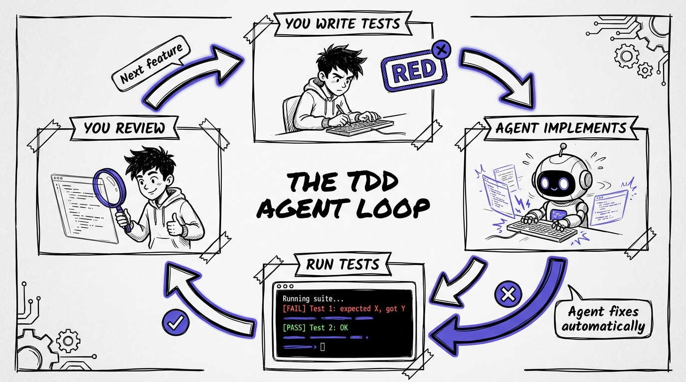
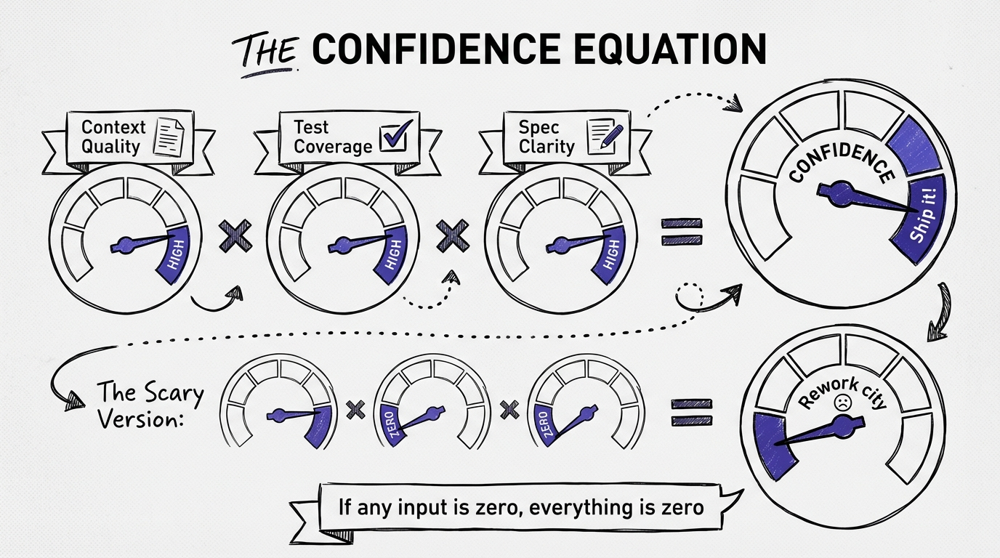

# Chapter 5: The TDD Agent Loop

*This is Chapter 13 in the full book.*

This is the workflow that changed everything for me. Not gradually, not theoretically, but immediately and measurably. The TDD Agent Loop is the single highest-confidence way to work with AI coding agents, and once you've used it, going back feels reckless.

The concept is simple: write the tests first, then let the agent write the code to make them pass.

That's it. That's the workflow. But the devil (and the value) is in the details of how you structure the tests, how you prompt the agent, how you handle failures, and how you review the result.

## Why TDD + Agents Is a Perfect Match

Test-driven development has been around since the early 2000s. It's always been a good practice. But it had a cost: writing tests first is slower than writing code first, at least in the short term. You're essentially writing the code twice, once as a specification (the tests) and once as an implementation.

Agents eliminate the second half of that cost. You write the tests. The agent writes the implementation. The total time is less than writing just the implementation by hand, because:


1. **The tests serve as an unambiguous spec.** The agent doesn't have to guess what you want. The tests define it.
2. **The agent can self-correct.** When a test fails, the agent sees the failure message, understands what went wrong, and fixes it. No human in the loop needed for mechanical corrections.
3. **Your review is simplified.** Instead of reviewing the code to see if it works, you verify that the tests are comprehensive and the code is clean. The "does it work?" question is already answered.
4. **Confidence is built-in.** When all tests pass, you know the code does what you specified. Not what the agent assumed. What you specified.

Addy Osmani put it well: "The more comprehensive your tests, the more confidently you can delegate." The TDD Agent Loop takes this to its logical conclusion: your tests ARE your delegation.

## The Loop in Detail



Here's the workflow, step by step.

### Step 1: Understand the Requirement

Before writing anything, be clear on what you're building. This sounds obvious, but agents amplify confusion. If you're unclear about the requirement, you'll write vague tests, the agent will write code that passes vague tests, and you'll end up with code that technically works but doesn't actually solve the problem.

Spend 5 minutes with the requirement. Write it in plain language if it helps:

```
I need a service that calculates shipping costs.
- Free shipping for orders over $100
- Flat rate $5.99 for standard shipping
- Flat rate $12.99 for express shipping
- No shipping to PO boxes for express
- Tax is NOT applied to shipping costs
```

This isn't a prompt for the agent yet. This is your own understanding.

### Step 2: Write the Tests

Now write the tests. All of them. Before any implementation exists.

```csharp
public class ShippingCalculatorTests
{
    private readonly ShippingCalculator _calculator = new();

    [Fact]
    public async Task Calculate_OrderOver100_StandardShipping_ReturnsFree()
    {
        // Arrange
        var order = new Order { Total = 150.00m, ShippingMethod = ShippingMethod.Standard };

        // Act
        var result = await _calculator.CalculateAsync(order);

        // Assert
        result.ShippingCost.Should().Be(0m);
    }

    [Fact]
    public async Task Calculate_OrderUnder100_StandardShipping_ReturnsFlatRate()
    {
        // Arrange
        var order = new Order { Total = 50.00m, ShippingMethod = ShippingMethod.Standard };

        // Act
        var result = await _calculator.CalculateAsync(order);

        // Assert
        result.ShippingCost.Should().Be(5.99m);
    }

    [Fact]
    public async Task Calculate_OrderOver100_ExpressShipping_ReturnsFree()
    {
        // Arrange
        var order = new Order { Total = 200.00m, ShippingMethod = ShippingMethod.Express };

        // Act
        var result = await _calculator.CalculateAsync(order);

        // Assert
        result.ShippingCost.Should().Be(0m);
    }

    [Fact]
    public async Task Calculate_OrderUnder100_ExpressShipping_ReturnsFlatRate()
    {
        // Arrange
        var order = new Order { Total = 75.00m, ShippingMethod = ShippingMethod.Express };

        // Act
        var result = await _calculator.CalculateAsync(order);

        // Assert
        result.ShippingCost.Should().Be(12.99m);
    }

    [Fact]
    public async Task Calculate_ExpressToPoBox_ThrowsInvalidOperationException()
    {
        // Arrange
        var order = new Order
        {
            Total = 50.00m,
            ShippingMethod = ShippingMethod.Express,
            Address = new Address { Line1 = "PO Box 123" }
        };

        // Act
        var act = () => _calculator.CalculateAsync(order);

        // Assert
        await act.Should().ThrowAsync<InvalidOperationException>()
            .WithMessage("*PO Box*");
    }

    [Fact]
    public async Task Calculate_ShippingCost_DoesNotIncludeTax()
    {
        // Arrange
        var order = new Order
        {
            Total = 50.00m,
            ShippingMethod = ShippingMethod.Standard,
            TaxRate = 0.08m
        };

        // Act
        var result = await _calculator.CalculateAsync(order);

        // Assert
        result.ShippingCost.Should().Be(5.99m);
        result.TaxOnShipping.Should().Be(0m);
    }

    [Theory]
    [InlineData(99.99, 5.99)]
    [InlineData(100.00, 5.99)]
    [InlineData(100.01, 0)]
    public async Task Calculate_BoundaryValues_ReturnsCorrectCost(
        decimal orderTotal, decimal expectedShipping)
    {
        // Arrange
        var order = new Order { Total = orderTotal, ShippingMethod = ShippingMethod.Standard };

        // Act
        var result = await _calculator.CalculateAsync(order);

        // Assert
        result.ShippingCost.Should().Be(expectedShipping);
    }
}
```

A few things to notice about these tests:

**They're thorough.** Happy path, edge cases, boundary values, error conditions. This isn't minimal test coverage. This is a complete specification.

**They define the API.** The tests force you to decide on the interface: `ShippingCalculator` with a `CalculateAsync` method that takes an `Order` and returns a result with `ShippingCost` and `TaxOnShipping`. You're designing the API, not the agent.

**They won't compile yet.** `ShippingCalculator`, `Order`, `ShippingMethod`, `Address`, none of these exist. That's fine. That's the point. The tests define what needs to exist.

**The boundary test is critical.** Is $100.00 exactly free or not? You decided: it's NOT free (the tests show $100.00 maps to $5.99, and $100.01 maps to free). That's a business decision you made explicitly. Without the test, the agent would guess, and guessing business rules is how bugs are born.

> **Note:** These examples use C# with xUnit and FluentAssertions, but the TDD Agent Loop works identically with any language and test framework. Python with pytest, TypeScript with Jest, Go with the testing package, Java with JUnit. The pattern is universal.

### Step 3: Prompt the Agent

Now you hand it to the agent. The prompt is simple because the tests do the heavy lifting:

```
Make all the tests in ShippingCalculatorTests pass.

The tests are in tests/Domain.Tests/ShippingCalculatorTests.cs.
Create the necessary types and implementation in src/Domain/.

Run the tests after implementation to verify they pass.
```

That's it. No 50-line prompt. No detailed specification. The tests ARE the specification.

If you've set up your AGENTS.md (Chapter 4), the agent already knows your project structure, coding conventions, and architecture patterns. If you have path-scoped rules, it knows the conventions for the Domain project specifically.

### Step 4: Let the Agent Iterate

Here's where the magic happens. The agent will:


1. Read the test file
2. Understand what types need to exist (`Order`, `Address`, `ShippingMethod`, `ShippingResult`, `ShippingCalculator`)
3. Create those types
4. Implement `CalculateAsync`
5. Run `dotnet test`
6. See which tests fail (if any)
7. Fix the failures
8. Run the tests again
9. Repeat until all tests pass

This iteration loop is the key to the whole workflow. The agent isn't generating code and hoping it works. It's generating code, testing it, and fixing what's broken. The feedback loop is tight, automatic, and objective.

In my experience, most tasks complete in 1-3 iterations. The agent gets it mostly right on the first try (thanks to the tests being clear and the context file providing conventions), catches a bug or two on the test run, and fixes them.

### Step 5: Review the Result

When all tests pass, the agent presents you with the implementation. Now you review.

But here's what's different about this review compared to reviewing code without the TDD loop: **you already know it works.** The tests pass. The behavior is correct. Your review focuses on:

**Code quality:** Is it clean? Is it readable? Does it follow your conventions?

**Design decisions:** Did the agent make reasonable choices about how to structure the code? Is the approach maintainable?

**Edge cases you missed:** Did the agent handle any cases your tests didn't cover? (Sometimes agents add defensive code that's valuable. Sometimes they add unnecessary complexity.)

**Security and performance:** Does anything look risky? For a shipping calculator, probably not. For an authentication handler, this review is critical.

Here's what the agent might produce:

```csharp
namespace Domain;

public enum ShippingMethod
{
    Standard,
    Express
}

public record Address
{
    public required string Line1 { get; init; }
    public string? Line2 { get; init; }
    public string? City { get; init; }
    public string? State { get; init; }
    public string? ZipCode { get; init; }
}

public record Order
{
    public decimal Total { get; init; }
    public ShippingMethod ShippingMethod { get; init; }
    public Address? Address { get; init; }
    public decimal TaxRate { get; init; }
}

public record ShippingResult
{
    public decimal ShippingCost { get; init; }
    public decimal TaxOnShipping { get; init; }
}

public class ShippingCalculator
{
    private const decimal FreeShippingThreshold = 100.01m;
    private const decimal StandardRate = 5.99m;
    private const decimal ExpressRate = 12.99m;

    public Task<ShippingResult> CalculateAsync(Order order)
    {
        if (order.ShippingMethod == ShippingMethod.Express &&
            order.Address?.Line1?.Contains("PO Box", StringComparison.OrdinalIgnoreCase) == true)
        {
            throw new InvalidOperationException(
                "Express shipping is not available for PO Box addresses.");
        }

        var isFreeShipping = order.Total >= FreeShippingThreshold;

        var shippingCost = isFreeShipping
            ? 0m
            : order.ShippingMethod == ShippingMethod.Express
                ? ExpressRate
                : StandardRate;

        return Task.FromResult(new ShippingResult
        {
            ShippingCost = shippingCost,
            TaxOnShipping = 0m
        });
    }
}
```

Review checklist:
- ✅ All tests pass
- ✅ Uses records for DTOs (matches our convention)
- ✅ Constants extracted (clean)
- ✅ Async pattern correct (even though this is synchronous internally, the interface is async for future flexibility)
- ✅ PO Box check is case-insensitive (good defensive choice)
- ⚠️ The "PO Box" detection is naive (only checks Line1, only checks exact string). Might want to improve this later.

That last point is a judgment call. The agent implemented what the tests specified. If you want better PO Box detection, write a test for it. That's the loop.

### Step 6: Expand (Optional)

Sometimes after the initial implementation, you think of additional cases:

```csharp
[Fact]
public async Task Calculate_ExpressToPoBox_CaseInsensitive_ThrowsException()
{
    var order = new Order
    {
        Total = 50.00m,
        ShippingMethod = ShippingMethod.Express,
        Address = new Address { Line1 = "po box 456" }
    };

    var act = () => _calculator.CalculateAsync(order);

    await act.Should().ThrowAsync<InvalidOperationException>();
}

[Fact]
public async Task Calculate_ExpressToPoBoxInLine2_ThrowsException()
{
    var order = new Order
    {
        Total = 50.00m,
        ShippingMethod = ShippingMethod.Express,
        Address = new Address { Line1 = "123 Main St", Line2 = "PO Box 789" }
    };

    var act = () => _calculator.CalculateAsync(order);

    await act.Should().ThrowAsync<InvalidOperationException>();
}
```

Run the agent again: "Make the new tests pass without breaking existing tests." The agent updates the implementation. You review. Cycle complete.

## When the Loop Shines

The TDD Agent Loop is particularly effective for:

### Business Logic

Services, calculators, validators, anything with clear inputs and outputs. These are the tasks where tests are easiest to write and agent implementations are most reliable.

### API Endpoints (Integration Tests)

Write integration tests that hit your endpoints through `WebApplicationFactory`, specifying the expected request/response contracts. Let the agent build the full vertical slice: controller, handler, repository calls.

```csharp
[Fact]
public async Task CreateOrder_ValidRequest_Returns201WithLocation()
{
    // Arrange
    var client = _factory.CreateClient();
    var request = new CreateOrderRequest("SKU-001", 2);

    // Act
    var response = await client.PostAsJsonAsync("/api/v1/orders", request);

    // Assert
    response.StatusCode.Should().Be(HttpStatusCode.Created);
    response.Headers.Location.Should().NotBeNull();

    var order = await response.Content.ReadFromJsonAsync<OrderResponse>();
    order.Should().NotBeNull();
    order!.Sku.Should().Be("SKU-001");
    order.Quantity.Should().Be(2);
}
```

This single test tells the agent to create the endpoint, the request/response types, the handler, and wire everything up. The agent builds the full feature to make the test pass.

### Refactoring

Write tests that capture the current behavior, then ask the agent to refactor the implementation. The tests ensure the refactoring doesn't break anything. This is one of the safest ways to let agents work on existing code.

### Bug Fixes

Write a test that reproduces the bug (it should fail). Ask the agent to make it pass without breaking existing tests. The bug fix is verified by definition.

## When the Loop Struggles

The TDD Agent Loop isn't a silver bullet. It works poorly for:

**UI work.** Testing visual output is hard to express in unit/integration tests. You can test behavior (click this, expect this state) but visual correctness requires human eyes.

**Exploratory work.** When you don't know what you want yet, you can't write tests for it. Use agents in chat/explore mode first, figure out the approach, then switch to TDD for the implementation.

**Infrastructure and configuration.** Testing Terraform modules, Docker configurations, or CI/CD pipelines requires different tools than `dotnet test`. The loop concept still applies (define expected behavior, let the agent implement, verify) but the test framework is different.

**Performance optimization.** Tests verify correctness, not performance. An agent can make all tests pass with an O(n²) algorithm when you needed O(n log n). Performance review remains a human judgment.


## The Full Cycle in Practice

Let me walk through a realistic workday scenario using the TDD loop.

**9:00 AM:** You pick up a ticket to add a discount code system. You spend 15 minutes understanding the requirements and sketching the domain model on paper.

**9:15 AM:** You write 8 tests covering: valid discount application, expired code rejection, usage limit enforcement, minimum order threshold, percentage vs. fixed discounts, stacking rules, and case-insensitive code lookup.

**9:45 AM:** You prompt the agent: "Make all tests in DiscountServiceTests pass. Create types in src/Domain/Discounts/. Follow the existing patterns in src/Domain/Shipping/ for reference."

**9:50 AM:** Agent completes. All 8 tests pass on the second iteration (it missed the case-insensitive lookup on the first try, caught it when the test failed, fixed it).

**9:55 AM:** You review the implementation. Clean code, follows conventions, handles all cases. You notice it created a separate `DiscountCode` entity and `IDiscountRepository` interface, which fits your architecture. You approve.

**10:00 AM:** You write 3 integration tests for the API endpoint: apply discount to order (happy path), apply invalid code (400 response), and apply to order below minimum (422 response).

**10:10 AM:** Agent prompt: "Make the new integration tests pass. Create the endpoint, handler, and wire up the discount service."

**10:15 AM:** Agent completes. All tests pass. You review the controller, handler, and DI registration. Everything follows your conventions (thanks to the AGENTS.md file). You approve and commit.

**Total time:** 1 hour 15 minutes for a complete discount code feature with full test coverage, clean architecture, and verified behavior.

Without the TDD loop, this would be 3-4 hours of implementation, manual testing, debugging, and review. With naive agent use (no tests, no context), it might be 2-3 hours plus accumulated technical debt from code that "works" but doesn't fit your architecture.

## Making It Stick

The hardest part of the TDD Agent Loop isn't the technique. It's the habit change. You have to resist the urge to prompt the agent immediately and instead invest the 15-30 minutes in writing tests first.

Here's what helps:

**Start small.** Pick one task tomorrow and try the loop. A bug fix is ideal, because writing a reproducing test is natural. See how it feels. See the results.

**Timebox the tests.** Give yourself 30 minutes maximum to write tests. If the tests are taking longer than that, the task might be too big. Break it down.

**Keep a "tests I wish I'd written" list.** When you skip the TDD loop and regret it (because the agent produced garbage you had to rewrite), note it. The list builds the habit by making the cost of skipping visible.

**Pair the loop with context files.** The TDD Agent Loop is good on its own. Combined with a well-maintained AGENTS.md, it's transformative. The context file handles the "how" (conventions, patterns, structure), and the tests handle the "what" (behavior, correctness, edge cases). Together, they constrain the agent into a small space where almost any output is acceptable.

## The Confidence Equation



Here's the mental model that ties this chapter to the rest of the book:

**Agent confidence = Context quality × Test coverage × Specification clarity**

If any of those three is zero, your confidence in the output is zero, regardless of how good the other two are. But when all three are high:

- **Context** tells the agent how to write (conventions, patterns, architecture)
- **Tests** tell the agent what to write (behavior, edge cases, contracts)
- **Specification** tells the agent why (business rules, constraints, intent)

The TDD Agent Loop maximizes the first two. The specification (your test names, your requirement notes, your prompt) handles the third. When all three are dialed in, you can trust agent output at a level that makes the productivity gains real, not illusory.

This is the answer to the METR paradox. The developers in that study had low context, no tests-first workflow, and vague specifications. Of course they were slower. The agents had nothing to work with except the prompt and the code.

Give agents context, tests, and clarity, and the equation inverts. You're not 19% slower. You're 2-3x faster. And you can prove it, because the tests prove it.

That's the TDD Agent Loop. Write the tests. Let the agent handle the rest. Review with confidence.
