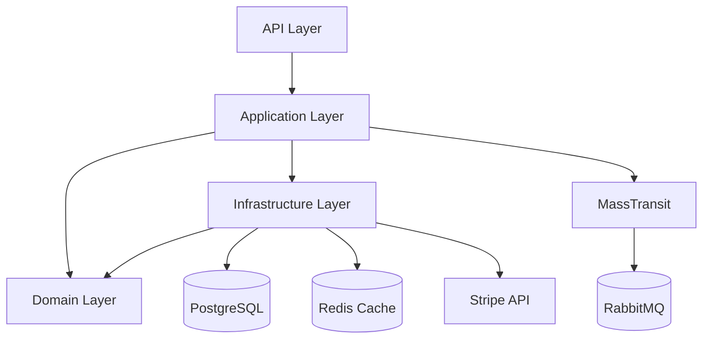

# Chapter 16: Codebase Archaeology and Documentation

Every developer has inherited a codebase they didn't write. You stare at the folder structure, open a few files, try to trace a request from the controller to the database, get lost somewhere in a maze of abstractions, and wonder if anyone on the original team is still at the company.

This is codebase archaeology: understanding existing code well enough to change it safely. Before agents, it was slow, manual, and error-prone. You'd read code for hours, scribble diagrams on whiteboards, and hope your mental model was accurate.

Agents change this completely. Instead of reading code, you interview your codebase.

## "How Does Our Auth System Work?"

This single prompt, given to an agent with codebase access, produces more useful output than an hour of code reading:

```
Explain how authentication and authorization work in this codebase.
Start from an incoming HTTP request and trace through every layer.
Include middleware, token validation, claims extraction, and how
authorization policies are enforced on endpoints.
Reference specific files and line numbers.
```

The agent reads your `Program.cs`, finds the authentication middleware configuration, traces through the JWT bearer setup, identifies the custom claims transformer, finds the authorization policies, and produces a clear explanation with file references. In 2-3 minutes, you have a mental model that would have taken an hour to build manually.

This works because agents are good at two things that make code reading hard for humans: holding a lot of context simultaneously, and following reference chains across files without losing track.

When you read code manually, you open a file, see a method call, navigate to the definition, see another method call, navigate again, and by the time you're four files deep, you've forgotten why you started. Agents don't have this problem. They can hold the entire call chain in context and produce a coherent summary.

## Onboarding to Unfamiliar Codebases


The most valuable application of codebase archaeology is onboarding. Whether you're joining a new team, picking up a legacy project, or reviewing an open-source library, agents compress the onboarding timeline dramatically.

Here's an onboarding workflow I use when joining a new codebase:

### Step 1: The Overview

```
Give me a high-level overview of this codebase.
What does it do? What's the architecture?
What are the main projects/modules and their responsibilities?
What frameworks and libraries does it use?
```

This gives you the 30,000-foot view. The agent reads the solution file, project references, key configuration files, and top-level folder structure. You get a summary like:

"This is an ASP.NET Core 9 API with a clean architecture structure: Domain (business logic, no dependencies), Application (use cases, MediatR handlers), Infrastructure (EF Core, external services), and API (minimal API endpoints). It uses PostgreSQL via EF Core, MassTransit for messaging, and Redis for caching. There are 47 endpoints organized by feature."

In two minutes, you know more about this codebase than most README files would tell you.

### Step 2: Key Flows

Pick the 3-4 most important user flows and trace them:

```
Trace the complete flow for creating an order:
1. HTTP request hits the endpoint
2. Request validation
3. Business logic execution
4. Database persistence
5. Any events/messages published
6. Response returned

Show me the specific files and methods involved at each step.
```

This builds your mental model of how the codebase actually works, not how it's supposed to work (those are often different). The agent follows the real code path, including any middleware, filters, or interceptors that affect the flow.

### Step 3: The Gotchas

```
What are the non-obvious aspects of this codebase?
Look for:
- Custom conventions that differ from standard ASP.NET Core
- Hidden side effects (event handlers, background jobs triggered by actions)
- Configuration that changes behavior based on environment
- Any global filters, middleware, or DI decorators that affect all requests
- Known workarounds or technical debt (check for TODO/HACK/FIXME comments)
```

This is where agents really earn their keep. They'll find the custom exception filter that swallows certain errors, the background job that runs on every order creation (but only in production), and the environment variable that switches between two completely different caching strategies. These are the things that bite you on day three.

### Step 4: The Test Suite

```
Analyze the test suite:
- What's the testing strategy? Unit, integration, end-to-end?
- Which areas have good coverage? Which are thin?
- What test frameworks and libraries are used?
- Are there any test helpers or base classes I should know about?
- How do I run the tests locally?
```

Understanding the test suite tells you how the previous team thought about quality and where the safety nets are (and aren't).

## Generating Internal Documentation


Most codebases are under-documented. Not because developers are lazy, but because documentation rots. You write a README when you start the project, and by month six, it's out of date. You write API docs once, and after twenty endpoint changes, they describe a system that no longer exists.

Agents can generate documentation from the code itself, which means the documentation reflects what the code actually does, not what someone remembered to write down.

### README Generation

```
Generate a comprehensive README.md for this project. Include:
- What the project does (read the code, don't guess)
- Prerequisites and setup instructions (check Docker files, scripts, config)
- How to run locally (check launchSettings.json, docker-compose, scripts)
- How to run tests
- Project structure with brief description of each project/folder
- Key configuration settings and environment variables
- API overview (list main endpoint groups)
```

The agent produces a README based on reality. It checks `docker-compose.yml` for service dependencies, reads `launchSettings.json` for ports and URLs, examines the test project for the test runner, and lists the actual endpoints from the code.

### API Documentation

For internal APIs that don't justify a full OpenAPI setup:

```
Generate API documentation for all endpoints in the API project.
For each endpoint, include:
- HTTP method and path
- Request body schema (if any)
- Response codes and their meanings
- Response body schema
- Authentication requirements
- Any notable behavior (caching, rate limiting, side effects)

Format as markdown. Group by feature area.
```

The agent reads every endpoint definition, traces the request/response types, checks for `[Authorize]` attributes or authorization policies, and produces complete API docs. For a 50-endpoint API, this takes the agent a few minutes and saves you days of manual documentation.

### Architecture Documentation

```
Generate an architecture document that describes:
- The overall architecture pattern and layer responsibilities
- How dependency injection is configured
- The data access strategy (EF Core configuration, migrations, conventions)
- The messaging/event system (publishers, consumers, message types)
- Cross-cutting concerns (logging, error handling, caching, auth)
- External service integrations

Include a component diagram in Mermaid format.
```

The Mermaid diagram is particularly useful. Agents generate reasonable architecture diagrams from code that you can include in your docs:



Is it perfect? No. Is it better than no diagram at all? Absolutely. And you can refine it in 5 minutes.

## Architecture Decision Records from Existing Code

This is one of my favorite uses of codebase archaeology. Most teams don't write ADRs. But the architectural decisions are embedded in the code. Agents can extract them.

```
Analyze this codebase and identify the major architectural decisions
that were made. For each one, generate an ADR that includes:
- What the decision was
- What the likely alternatives were
- Why this choice was probably made (infer from the code and patterns)
- What the consequences are

Focus on decisions that a new developer would question, like:
- Why clean architecture instead of vertical slices?
- Why MassTransit instead of raw RabbitMQ?
- Why repository pattern when EF Core already abstracts the database?
- Why MediatR for in-process messaging?
```

The agent produces retrospective ADRs that capture tribal knowledge. These aren't as good as ADRs written at decision time (you're inferring intent, not documenting it), but they're vastly better than nothing. They give new team members a starting point for understanding why the codebase looks the way it does.

Mark these as "retrospective" ADRs so readers know they're inferred:

```markdown
# ADR-001 (Retrospective): Clean Architecture Pattern

## Status
Accepted (inferred from codebase analysis, February 2026)

## Context
The codebase uses a clean architecture pattern with four layers...
```

## From "Reading Code" to "Interviewing Your Codebase"

The mental shift here is significant. You're not reading code line by line. You're asking questions and getting answers.


Some questions that work well as codebase interviews:

**Understanding behavior:**
- "What happens when a user's subscription expires?"
- "How does the retry logic work for failed payment charges?"
- "What validations run before an order is submitted?"

**Understanding design:**
- "Why does the OrderService depend on IEventPublisher?"
- "What's the relationship between User, Account, and Profile?"
- "How are database transactions managed across multiple repository calls?"

**Understanding risk:**
- "Which endpoints have no authorization checks?"
- "Where does the codebase handle sensitive data (PII, payment info)?"
- "What happens if the Redis cache is unavailable?"

**Understanding dependencies:**
- "Which services would break if the payment provider's API changes?"
- "What external services does the order creation flow depend on?"
- "Which NuGet packages are outdated by more than one major version?"

Each of these questions would take 15-60 minutes to answer manually. An agent with codebase access answers them in 1-3 minutes. Over the course of onboarding to a new codebase, this compresses weeks of exploration into days.

## Keeping Generated Docs Current

Generated documentation has the same rot problem as hand-written documentation: the code changes, and the docs don't.

The solution is to regenerate, not maintain. Treat generated docs as artifacts, not source documents. Here's how:

### Option 1: Regeneration Prompts in Your Repo

Keep the prompts that generated your docs alongside the docs:

```
docs/
  architecture.md
  api-reference.md
  prompts/
    generate-architecture.md
    generate-api-reference.md
```

When the code changes significantly, rerun the prompts. The agent generates fresh docs from the current code. You review and commit.

### Option 2: CI-Triggered Doc Generation

For teams, add a documentation step to your CI pipeline that runs on significant changes:

```yaml
# .github/workflows/docs.yml
on:
  push:
    branches: [main]
    paths:
      - 'src/**'
      - '!src/**/*.Tests/**'

jobs:
  update-docs:
    runs-on: ubuntu-latest
    steps:
      - uses: actions/checkout@v4
      - name: Generate docs
        run: |
          # Use your agent CLI of choice to regenerate docs
          # from the prompts in docs/prompts/
```

This isn't fully automated (you still review the PR the agent creates), but it ensures documentation stays within one merge of the current code.

### Option 3: Review-Time Generation

The lightest approach: generate docs only when you need them. Before a code review, before onboarding a new team member, before a planning session. The docs are ephemeral, generated on demand, always current because they're generated from the current code.


This sounds wasteful (regenerating docs every time) but agent-generated docs are cheap. A full API reference for a 50-endpoint API takes the agent 2-3 minutes. That's cheaper than maintaining a stale document that misleads people.

## The Compounding Value

Codebase archaeology with agents has a compounding effect. Each answer builds your mental model. After a few sessions of interviewing your codebase, you understand it well enough to work effectively. The agent didn't just answer your questions; it transferred knowledge from the code to you.

And the documentation you generate along the way helps the next person. They read the architecture doc, the API reference, the retrospective ADRs, and they start from a much higher baseline. Then they use agents to fill in the gaps specific to their needs.

This is how institutional knowledge stops being locked in people's heads and starts being accessible in the codebase itself. Not as stale wiki pages, but as living documents that can be regenerated from the code at any time.

The codebase is the source of truth. Agents are the interpreters. Documentation is the output. Keep the interpreters handy, and the output is always fresh.
