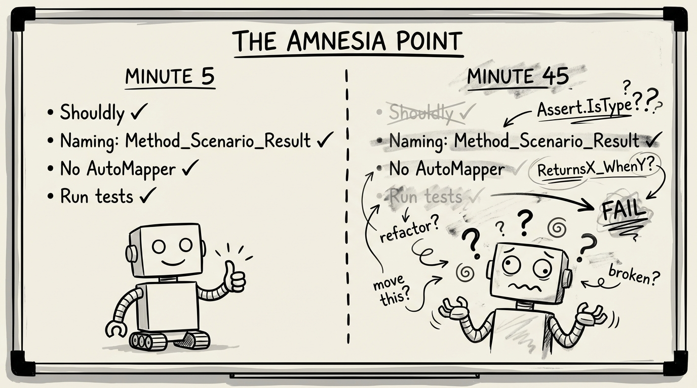
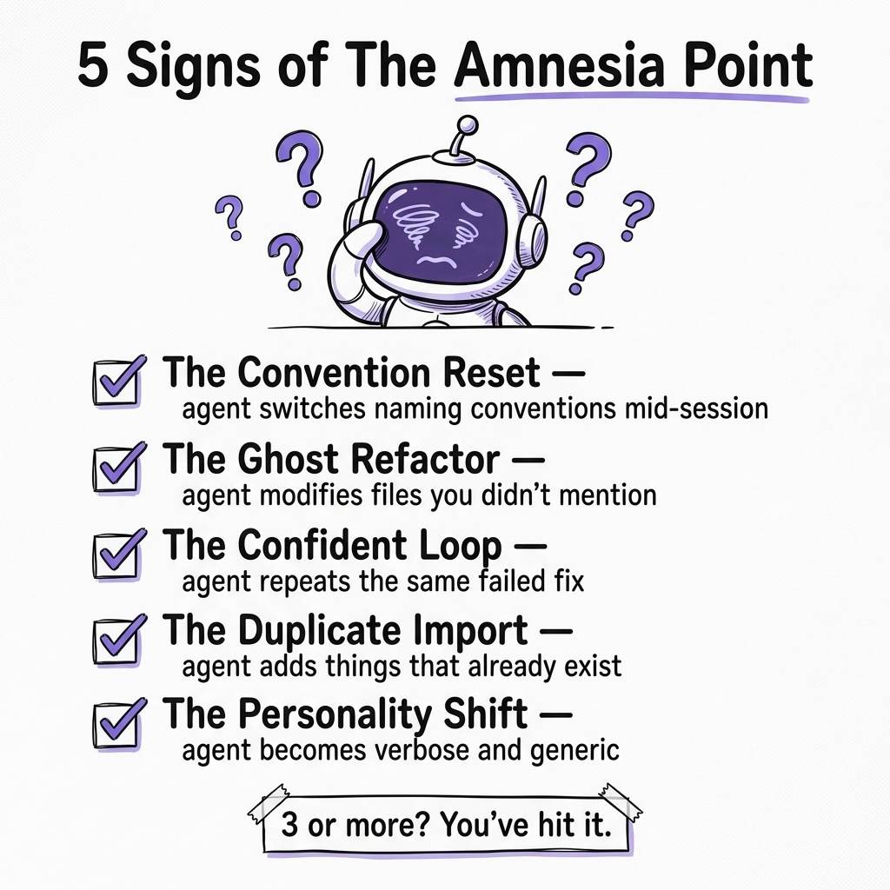
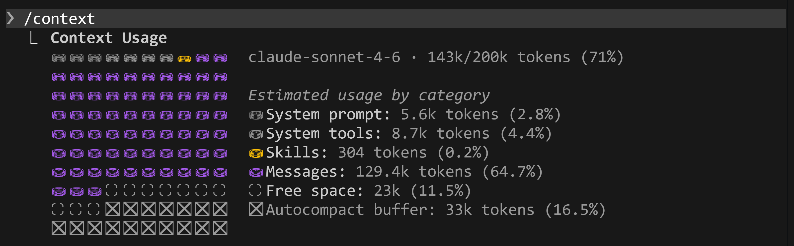

# Post #3 Draft: The Agentic Developer

**Subject line:** Amnesia.
**Subtitle:** Your AI coding agent forgets what it's doing after 20 minutes. Here's why, and what to do about it.

---

You're 45 minutes into a Claude Code session. Everything's going great. You've added three endpoints, fixed a failing test, wired up the AppHost config.

Then you ask Claude to update the integration test for the endpoint it built 15 minutes ago.

And it rewrites the file from scratch. Different naming conventions. Different assertion library. Like the last 40 minutes never happened.

You didn't change anything. You didn't confuse it. **Your session just forgot itself.**

This is the thing nobody warns you about with AI coding agents. The context window (that 200K token buffer that sounds enormous) has a cliff. And once you fall off it, the agent doesn't throw an error. It doesn't warn you. It just starts confidently producing garbage that *looks* like competent code.

I call it **The Amnesia Point.**

And if you've been using Claude Code, Copilot, or Cursor for more than a few weeks, I guarantee you've hit it. You just didn't know it had a name.

## What's actually happening inside the window

Every time you interact with Claude Code, the conversation grows. Your prompts, its responses, file reads, build output, test results, error logs. All of it stacks into a single context window.

Think of it like a whiteboard. Every exchange writes something on that whiteboard. The board is big. 200,000 tokens big. But it's not infinite.



At around 65-70% capacity, Claude Code does something called **auto-compaction**. It summarizes the conversation to free up space. Sounds reasonable. Like erasing the less important stuff on the whiteboard to make room for new work.

But here's what it actually means in practice:

→ Architectural decisions you discussed at minute 5? Summarized into a sentence. Or gone entirely.

→ That naming convention you established through three rounds of feedback? Compressed into something generic. Or dropped.

→ The specific Shouldly assertion pattern you corrected twice? Lost. The agent falls back to `Assert.IsType` because that's what its training data says is most common.

→ The guardrail where you said "never modify files I didn't mention"? Compacted away. Now it's refactoring your DbContext while you asked it to add a query parameter.

And it gets worse before compaction even fires.

Stanford researchers found that language model performance degrades **15-47%** as context fills up, even with the full conversation intact. The model literally pays less attention to information in the middle of a long conversation. They called it "Lost in the Middle." The information is technically *there*. The model just stops using it effectively.

So you have two problems:

1. **Before compaction:** The model gradually ignores your early instructions as the conversation grows.
2. **After compaction:** The model literally doesn't have your early instructions anymore.

Both produce the same result: the agent at minute 60 is a fundamentally different collaborator than the agent at minute 5. Same confidence. Different quality. And **you can't tell the difference by looking at the output.**

That last part is what makes this dangerous. A build error is obvious. A wrong variable name is obvious. But an agent that quietly switches from your project's conventions to Stack Overflow's conventions? That slips through code review. That ships to production.

## The five symptoms

Before I give you the fix, let me describe what The Amnesia Point looks like in practice. If three or more of these sound familiar, you've been living with this problem:



**1. The Convention Reset.** Your project uses Shouldly, `MethodName_Scenario_ExpectedResult`, and FluentAssertions for HTTP tests. At minute 40, the agent starts writing plain xUnit assertions and `ReturnsX_WhenY` test names. You correct it. It apologizes. Two prompts later, it does it again.

**2. The Ghost Refactor.** You asked Claude to add a DELETE endpoint. Instead, it also restructured three files you didn't mention, extracted a base class you didn't ask for, added a NuGet package you explicitly rejected twenty minutes ago, and moved a helper method to a new "shared" project. The guardrails you set early in the session got compacted away. Claude isn't being malicious. It's being *helpful* without the memory of what "helpful" means in your codebase.

**3. The Confident Loop.** Claude fixes a test. You run it. It fails. Claude "fixes" it again, with the exact same approach. Maybe it renames a variable. Maybe it adds a comment. But the structural problem is identical. This loop can go 4-5 rounds before you realize the agent lost the context of *why* the test was failing in the first place. It's pattern-matching on the error message without remembering the three things it already tried.

**4. The Duplicate Import.** You're working in an Aspire AppHost. Claude adds a project reference that already exists. Or it adds `using Microsoft.Extensions.DependencyInjection;` to a file that already has it. Small things. Easy to catch. But they're a canary. If the agent can't remember what's already in a file it read 10 minutes ago, it definitely can't remember the architectural decision you made verbally 30 minutes ago.

**5. The Personality Shift.** This one is subtle. Early in the session, Claude gives you concise, targeted responses. It respects your style. It asks clarifying questions. By minute 50, the responses get longer. More boilerplate. More "certainly!" and "I'd be happy to help with that!" The agent isn't just forgetting your code. It's forgetting the working relationship you established. It's reverting to its training data personality.

If you've ever thought "Claude got dumber during the session"... no. It got *amnesia*.

## The context audit (do this right now)

Before I give you the full system, I want you to do one thing.

Open Claude Code. Whatever session you're currently in. Type this:

```
/context
```

That's it. One command.

Since v2.1.74, `/context` doesn't just show you a progress bar. It gives you **actionable diagnostics**. It tells you what's eating your context window. Bloated CLAUDE.md, bash history accumulation, large file reads that are sitting in memory. And it gives you specific suggestions for each issue.

Here's what mine looks like after a normal working session:



71%. Messages alone eating 64.7% of the window. Only 11.5% free space before the autocompact buffer kicks in. And I wasn't doing anything unusual. Just reading files, asking questions, reviewing output. A normal session.

If you're above 50%, you've probably already hit The Amnesia Point without knowing it. The quality degradation starts well before the auto-compaction threshold.

Remember that number. We'll come back to it.

## How to beat it

You don't need a new tool. You don't need a bigger context window. You need three habits.

### Habit 1: The 50% Rule

Here's the rule: **if `/context` shows you're above 50%, start a new session.**

Not 80%. Not 70%. Fifty.

"But I'll lose all the context from this session."

You will. That's the point. A fresh session with a good CLAUDE.md will produce better code than a stale session where the agent is quietly forgetting your standards. Every time.

I know this feels wasteful. It felt wasteful to me too. But once I started rotating sessions at 50%, the number of "wait, why did it do that?" moments dropped to almost zero. The math is simple: two focused 20-minute sessions beat one degrading 60-minute session.

The auto-compaction threshold is around 80%. If you wait for that, the agent has already been producing lower-quality output for 15-20 minutes before compaction even fires. You're reviewing code that was written by a compromised collaborator. The 50% rule keeps you ahead of the degradation curve.

### Habit 2: The Handoff Note

Before you start a new session, ask Claude to write its own handoff:

```
Write a handoff note for the next session. Include:
- What we built in this session and where the files are
- Architectural decisions we made and why
- What's left to do next
- Any patterns or conventions we established
- Edge cases we discovered or things that didn't work

Save it to HANDOFF.md in the project root.
```

Here's a real one from a session where I analyzed a microservices codebase:

```markdown
# Session Handoff, March 12, 2026

## What we did
- Full codebase analysis (no code changed)
- Added keys/ directory to .gitignore
- Wrote README.md from scratch (architecture, per-service breakdown, purchase saga flow)

## Decisions found
- Database-per-service (MongoDB). Each service owns its data
- Event-driven via RabbitMQ + MassTransit. Async by default
- Saga orchestration in Trading. Distributed tx without 2PC

## Bugs discovered
- Guid.Parse without null guard in PurchaseController (crashes if sub claim missing)
- Quantity can go negative in SubtractItemsConsumer (no floor check)
- Deleted users persist forever in Trading's replica

## What to build next
- [ ] Tests. Zero test projects. Start with ItemsController unit tests
- [ ] Health checks. AddMongoDb + AddRabbitMQ in all four services
- [ ] Dockerfiles. One per service

## Conventions
- Entities implement IEntity, repos are IRepository<T> (singleton)
- AsDto() extension methods for all mapping
- All monetary values use decimal, all timestamps DateTimeOffset.UtcNow
```

Then in your next session: `Read HANDOFF.md before doing anything.`

This is the human equivalent of writing yourself a note before going to sleep. Your future session doesn't have your current session's memory. But it can read a file. And a 150-word handoff note is infinitely more useful than 50K tokens of compacted conversation.

### Habit 3: The 200-Word CLAUDE.md

Your CLAUDE.md is your insurance policy against amnesia. It loads automatically every session. It survives compaction. It's the one constant across every session, every day, every collaborator on your team.

But most developers write CLAUDE.md files that are either too vague or too long. Both are problems.

**Too vague:**
```markdown
# CLAUDE.md
Use the project's conventions. Run tests before committing.
```

Useless. Which conventions? What test command? This tells the agent nothing it can act on.

**Too long:**
```markdown
# CLAUDE.md
[2,000 words describing every architectural decision, the full 
history of the project, a style guide, deployment instructions, 
team contact info, and a paragraph about the company mission]
```

This eats 8K+ tokens on load. You just gave yourself a smaller context window before you even started working. And most of that information is irrelevant to the task at hand. You're accelerating toward The Amnesia Point before your first prompt.

**What actually works, the 200-word CLAUDE.md:**

```markdown
# CLAUDE.md

## Stack
- .NET 10 microservices (no Aspire, no orchestrator)
- MongoDB per service, RabbitMQ via MassTransit
- Duende IdentityServer 7 (Play.Identity)
- React frontend on :3000

## Build & Run
- Infrastructure first: `cd Play.Infra && docker compose up -d`
- Each service: `cd Play.*/src/Play.*.Service && dotnet run`
- Start Play.Identity first (JWT authority for all others)

## Architecture Rules
- Services communicate ONLY via MassTransit (pub/sub + point-to-point)
- Play.Common is a shared NuGet package, NOT a project reference
- Local entity replicas keep data fresh via events (don't query across services)
- Idempotent consumers track MessageIds in a HashSet on the entity

## Conventions
- Settings: `Configuration.GetSection(nameof(XxxSettings)).Get<XxxSettings>()`
- MassTransit endpoints: kebab-case `{ServiceName}-{MessageType}`
- BSON serializers: GuidSerializer(String), DateTimeOffsetSerializer(String)
- Contracts live in separate *.Contracts NuGet packages

## Guardrails
- NEVER modify files I didn't mention in my prompt
- NEVER add NuGet packages without asking
- NEVER restructure existing code as part of a new feature
- NEVER hardcode service URLs. Read from config

## Verification (run after every change)
- `dotnet build` in the affected service. Must succeed with zero warnings
- `dotnet test` in the matching test project. All tests must pass
- If either fails, fix it before reporting done
```

That's ~200 tokens on load. It contains every decision the agent needs to respect your codebase, in a fresh session, after compaction, at minute 1 or minute 30. And because it's short, it actually gets *read and applied* instead of getting lost in the middle of a bloated instruction set.

The key insight: **CLAUDE.md isn't documentation. It's a contract.** Write it like terms of service for your codebase, not like a README.

## What this doesn't fix

I want to be honest about the limits.

→ **Bad CLAUDE.md = bad output, consistently.** Session rotation won't save you if your instructions are vague. A fresh session with "use the project's conventions" will produce the same mediocre output every time. It'll just do it reliably.

→ **Deep debugging still needs long sessions.** If you're chasing a race condition across four services, you might need the full context window. Use `/context` to monitor, check the agent's work more carefully after 50%, and don't trust it the same way you did at the start.

→ **This isn't just Claude Code.** The core problem (attention degradation in long contexts) is model-level. Cursor, Copilot, Windsurf, Aider. They all have an Amnesia Point. The tools are different. The physics is the same.

## The 30-minute challenge

Try this today:

**Minutes 1-5:** Open your current Claude Code project. Run `/context`. Screenshot what you see. If you're above 50% and still working, congratulations. You just caught The Amnesia Point in action.

**Minutes 5-15:** Write a CLAUDE.md under 200 words. Use the template above. Focus on conventions, guardrails, and verification commands. Nothing else. If you already have one, cut it down. Shorter is better.

**Minutes 15-25:** Start a fresh session. Give it a task you'd normally do at the end of a long session. Compare the output quality to what you were getting before.

**Minutes 25-30:** Write your first HANDOFF.md. Even if it's rough. Even if it's five bullet points. The habit matters more than the format.

One session rotation. One CLAUDE.md. One handoff note. That's all it takes.

The developers shipping clean code with AI agents aren't smarter. They're not using a secret model or a magic prompt. They just learned to work *with* the context window instead of pretending it's infinite.

---

## So, how to keep your AI agent from forgetting everything mid-session?

✦ Run `/context` before you trust a long session. If you're above 50%, rotate.

✦ Write a HANDOFF.md before starting fresh. Your next session can't remember, but it can read.

✦ Keep your CLAUDE.md under 200 words. It's a contract, not a README.

Your agent isn't getting dumber. It's getting amnesia. Now you know how to treat it.

Julio

*What's the worst "amnesia moment" you've had in a coding session? Hit reply. I read every one.*

---

If this helped you, forward it to a developer who's been running 90-minute AI sessions and wondering why the output keeps getting worse. That's how this newsletter grows, one forwarded email at a time.
