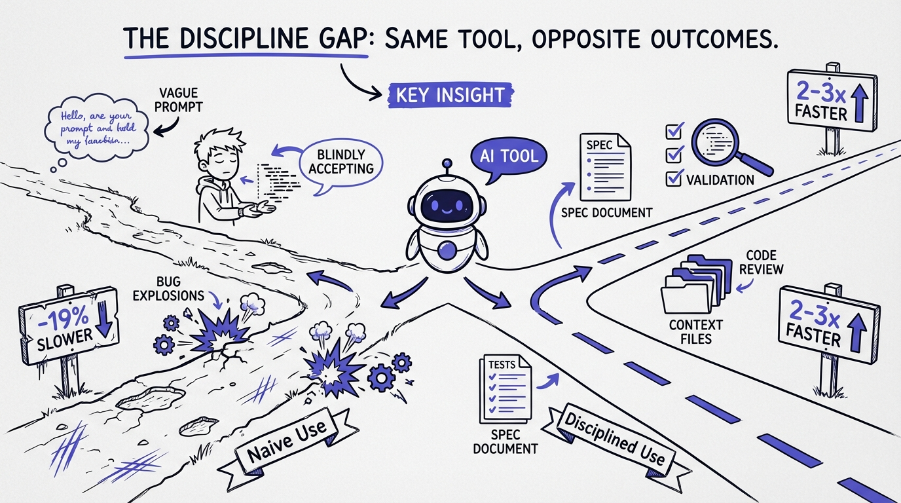

# 04 — The Discipline Gap: Same Tool, Opposite Outcomes

Two developers. Same AI agent. Same codebase. One ships faster and with fewer bugs. The other creates more technical debt than they resolve.

The difference isn't talent. It's discipline.

**The naive path:**
- Vague prompt → accept first output → realize it's wrong → debug → re-prompt → accept again → more debugging → ship something "good enough"
- Result: slower than writing it yourself, plus you've introduced bugs you don't fully understand

**The disciplined path:**
- Clear spec with acceptance criteria → provide rich context (AGENTS.md, examples, constraints) → agent generates → run tests → focused review → ship with confidence
- Result: faster than writing it yourself, and the code matches your architecture

The METR study confirmed this. The 19% slowdown wasn't universal. It was the *average*. Some developers in the study were genuinely faster with AI. Others were dramatically slower. The variable was methodology, not the tool.

This is why "just use AI" is terrible advice. It's like saying "just use a power tool." A circular saw makes a carpenter faster and a beginner dangerous.

The power tool doesn't change. The operator does.

**AI amplifies your methodology. If your process is sloppy, AI makes it sloppier, faster.**
