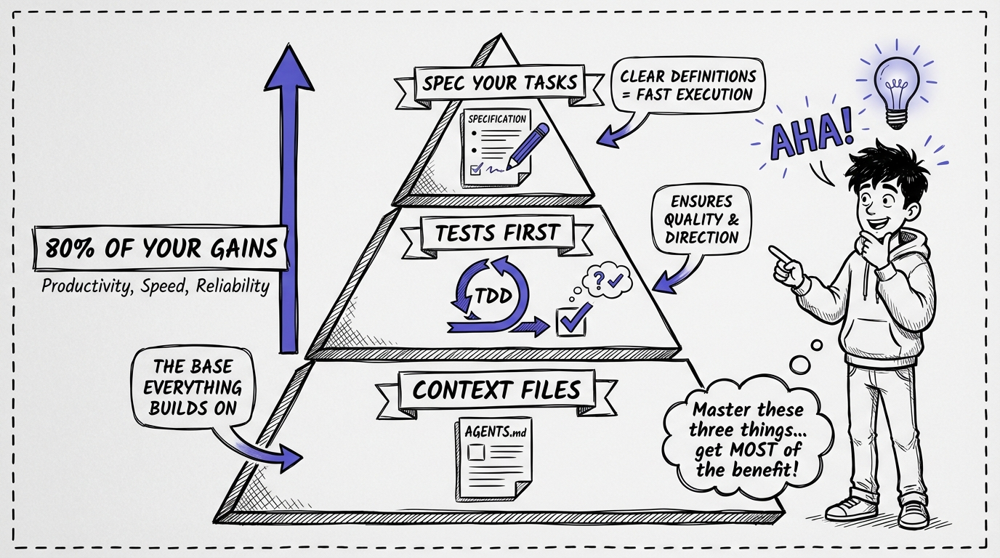

# 05 — The 80/20 Rule of Agentic Development

You don't need to master 50 techniques to be effective with AI agents. You need three.

These three practices drive roughly 80% of the productivity gains in agentic development. Everything else is optimization on top.

**1. Context Files (the foundation)**
A single AGENTS.md file that tells your agent how your project works: architecture patterns, naming conventions, libraries to use (and avoid), testing approach, deployment rules. Without it, your agent makes educated guesses. With it, your agent matches your codebase on the first try.

**2. Tests First**
Write a failing test before asking the agent to implement anything. The test becomes the spec. The agent knows exactly what "done" looks like. No ambiguity, no back-and-forth, no "that's not what I meant." Tests are the cheapest, most reliable way to communicate intent to an AI agent.

**3. Spec Your Tasks**
Don't say "add user authentication." Say "add JWT authentication using the existing AuthService pattern, with refresh token rotation, and write integration tests against the TestServer." Specificity eliminates entire categories of mistakes.

Context files tell the agent WHO it's working for. Tests tell it WHAT success looks like. Specs tell it HOW to get there.

Master these three, and you've captured 80% of the value. Everything else is gravy.

**Start here. Build these habits first. Then optimize.**
