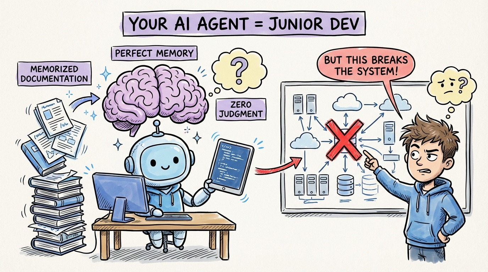

# 06 — Your AI Agent Is a Junior Dev with Perfect Memory and Zero Judgment

Here's the mental model that will save you the most time: your AI agent is a junior developer who has read every Stack Overflow answer ever written but has never shipped a production system.

Perfect memory. Zero judgment.

It knows the syntax of every language. It can recite design patterns from the Gang of Four book. It remembers every API signature in every framework. But it doesn't know *your* system. It doesn't know why you chose PostgreSQL over MongoDB. It doesn't know that the payment service has a 3-second timeout that breaks if you add another network hop.

This means two things. First, you never need to explain *how* to write a for loop or implement an interface. The agent knows mechanics cold. Second, you always need to explain *why* your system works the way it does. The agent has no institutional knowledge.

The developers who struggle with agents treat them like senior engineers. They give vague instructions and expect the agent to fill in context. The developers who thrive treat them like brilliant but inexperienced teammates. Clear specs. Explicit constraints. Documented decisions.

Your job isn't to type less. It's to think more clearly and communicate that thinking in a way machines can execute on.
