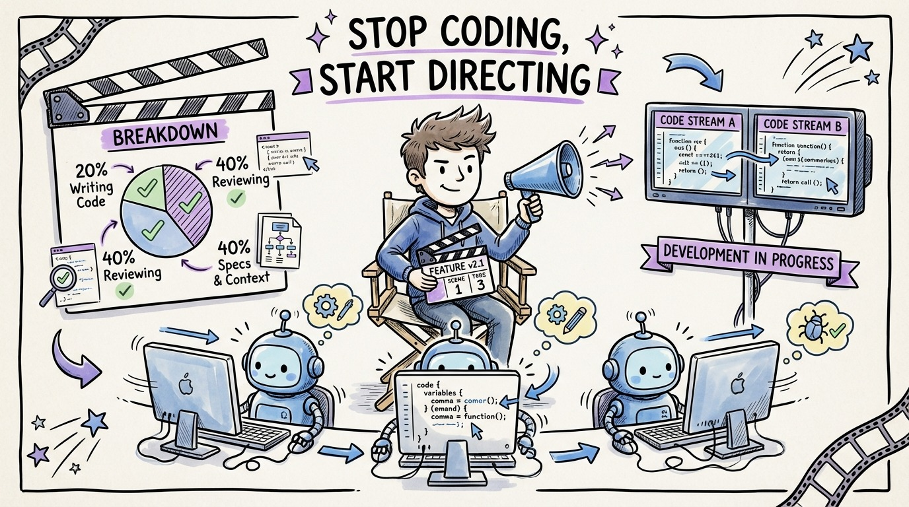

# 07 — Stop Coding, Start Directing

The best film directors don't operate the camera. They don't build the sets. They don't edit the footage. They do something harder: they hold the vision and communicate it so precisely that dozens of specialists can execute it.

That's your new job.

The shift from "developer who writes code" to "developer who directs agents" is the biggest career transition in software engineering since the move from waterfall to agile. And most people are doing it badly because they're stuck in the old mindset.

In the old world, your value was measured by lines of code shipped. In the new world, your value is measured by the quality of specifications you write, the precision of your context files, and the speed of your review cycles.

Addy Osmani nailed it: "You're trading typing time for review time, implementation effort for orchestration skill, writing code for reading and evaluating code."

A typical day for an effective agentic developer in 2026: 20% writing code by hand, 40% reviewing agent output, 40% on specs, architecture, and context engineering. That's not a small shift. That's a fundamentally different job.

The developers who resist this transition will be outpaced by those who embrace it. Not because agents replace developers, but because directed agents multiply developer output by 3-5x.
