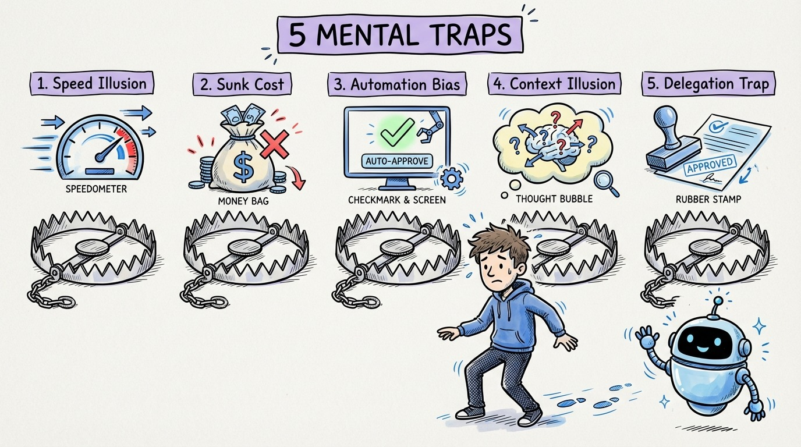

# 08 — The 5 Mental Traps of AI-Assisted Development

The METR study found a 39-point gap between perceived and actual productivity. That gap lives in five mental traps that catch even experienced developers.

**1. The Speed Illusion.** Watching an agent generate 200 lines in 3 seconds feels fast. But you still have to read, verify, and debug those 200 lines. Generation speed is not development speed.

**2. The Sunk Cost Trap.** You spent 5 minutes crafting the perfect prompt. The output is 70% right. So you spend 20 minutes fixing it instead of 10 minutes writing it from scratch. The prompt investment makes you irrational about the output.

**3. The Automation Bias.** AI-generated code looks confident. Clean formatting, proper variable names, reasonable structure. Your brain pattern-matches "looks professional" with "is correct." It often isn't.

**4. The Context Illusion.** You assume the agent understands your system because it uses the right terminology. It doesn't. It's pattern-matching from training data, not reasoning from your architecture.

**5. The Delegation Trap.** Once you start delegating to agents, you want to delegate everything. But some tasks (architecture decisions, security reviews, performance-critical code) need human judgment. The discipline to know when NOT to delegate is as important as knowing when to delegate.

Awareness is the antidote. Name the trap, break the trap.
