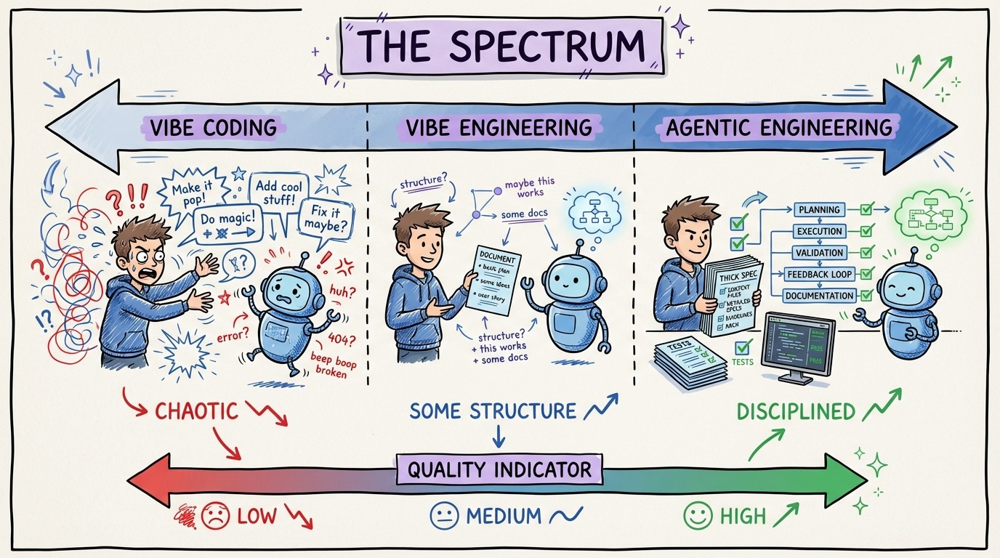

# 09 — The Spectrum: Vibe Coding to Agentic Engineering

Andrej Karpathy coined "vibe coding" in February 2025: throw a prompt at an AI, accept whatever comes back, don't read the code. By February 2026, he'd evolved to "agentic engineering," calling it "a serious engineering discipline involving autonomous agents."

That evolution maps to a spectrum every developer should understand.

**Vibe Coding** (left end): No specs, no tests, no review. "Make me a todo app." You accept whatever the agent produces. Works for throwaway prototypes. Dangerous for anything else.

**Vibe Engineering** (middle): Some structure, some review, but still largely prompt-and-pray. You have context files but they're thin. You review output but don't test rigorously. Most developers live here and think they're being productive.

**Agentic Engineering** (right end): Detailed specs. Comprehensive context files. TDD loop. Systematic review. Parallel agents. The agent is a tool in a disciplined workflow, not a magic wand.

The gap between vibe coding and agentic engineering is the gap between a hobby project and production software. Same tools, completely different methodology.

Most developers plateau at vibe engineering because it feels productive enough. The compounding returns of agentic engineering only become visible after 2-3 weeks of investment in context files, test suites, and disciplined workflows.
