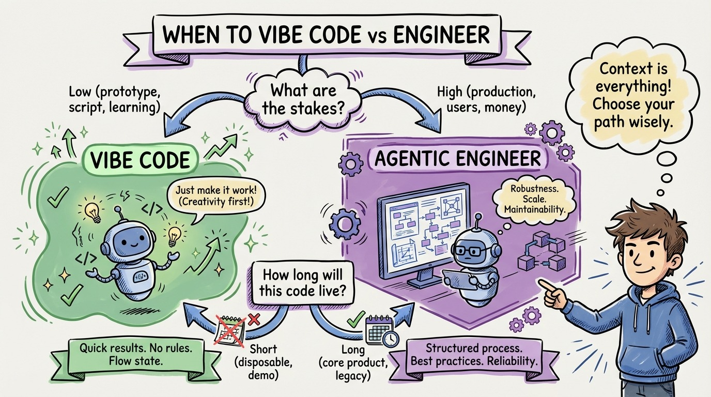

# 10 — When to Vibe Code vs When to Engineer

Not everything needs agentic engineering rigor. And not everything should be vibe coded. Here's the decision framework.

**Vibe Code when:** It's a prototype or throwaway script. Nobody else will maintain it. The blast radius of a bug is zero. You're exploring an idea, not building a product. Learning a new API. Internal tooling that only you use.

**Vibe Engineer when:** It's a side project with some users. The code matters but isn't mission-critical. You want decent quality without full ceremony. Blog demos, internal tools with a small team, MVPs you might throw away.

**Agentic Engineer when:** It's production code. Other people maintain it. Bugs cost money or trust. Security matters. The codebase will live for years. Any code that ships to customers.

The key variable is blast radius. How much damage can a bug cause? A broken prototype wastes your afternoon. A broken payment system costs real money.

The second variable is longevity. Code that lives for one day doesn't need tests. Code that lives for one year absolutely does, because future-you (or future-agent) will need to modify it safely.

Most developers default to vibe engineering for everything. The discipline is matching your methodology to the stakes. Low stakes, low ceremony. High stakes, full rigor.
