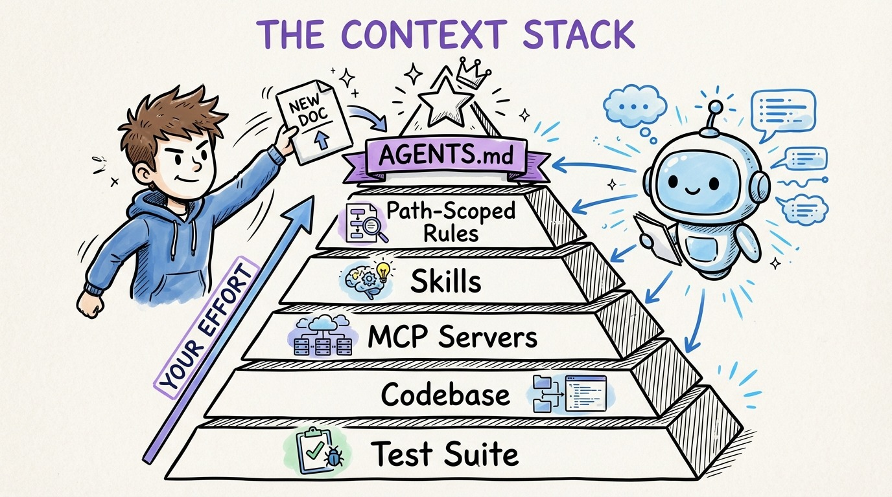

# 11 — The Context Stack: Where to Invest Your Effort

Modern AI agents load context from multiple layers. Understanding these layers tells you where your time investment has the highest return.

**Layer 1: AGENTS.md (highest leverage).** Your always-on project guidance file. Loads automatically every session. Documents conventions, architecture, what NOT to do. Create once, maintain ongoing. This single file is responsible for more agent quality improvement than everything else combined.

**Layer 2: Path-scoped rules.** Modular guidance for specific file types or directories. Controller conventions load only when the agent touches controllers. Test conventions load only in test files. Add these reactively as patterns emerge.

**Layer 3: Skills.** On-demand instruction sets the agent invokes when relevant. Complex workflows like "deploy to staging" or "create a new API endpoint" packaged as reusable recipes.

**Layer 4: MCP servers.** Live connections to external tools (databases, APIs, documentation). The agent queries these in real time instead of relying on stale training data.

**Layer 5: The codebase itself.** Your existing code IS context. Clean naming, small files, documented decisions, and comprehensive tests make agents dramatically more effective.

**Layer 6: Test suite.** Your most powerful verification layer. Tells the agent what correct behavior looks like and catches mistakes automatically.

Start with Layer 1. It takes 30 minutes and pays off immediately. Add the rest over weeks, not days.
