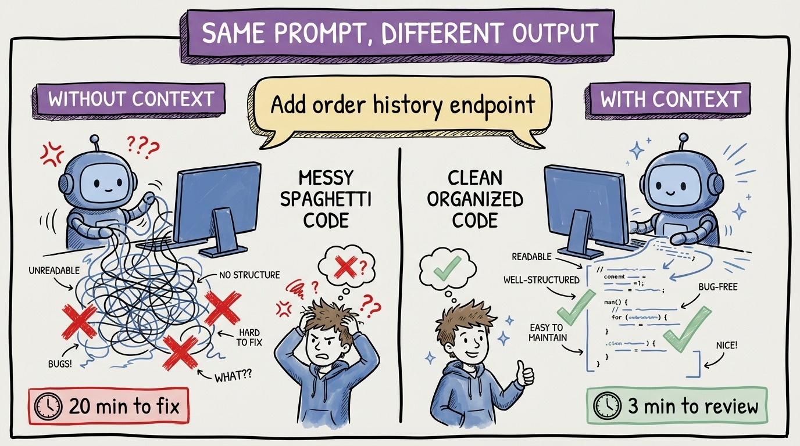

# 12 — Same Prompt, Wildly Different Output

Same agent. Same prompt. Completely different results. The only variable: context.

**Without context file.** Prompt: "Add an endpoint to get a user's order history." The agent produces a controller with direct DbContext access, AutoMapper for mapping, synchronous calls, no authentication, returns an unpaginated List. You spend 20 minutes rewriting it to fit your architecture.

**With context file.** Same prompt. The agent produces a controller that sends a GetOrderHistoryQuery via MediatR, a handler using the repository pattern, manual mapping, async throughout, [Authorize] attribute, paginated response with proper HTTP headers. You spend 3 minutes reviewing and approve it.

That's 17 minutes saved on a single task. Across a full day of agent interactions, that compounds to hours. Across a week, you're looking at an entire day of recovered productivity.

The agent didn't get smarter between those two attempts. It got better informed. Your context file told it: use MediatR for CQRS, repository pattern for data access, no AutoMapper, async everywhere, all endpoints need [Authorize].

Every convention you document is a convention the agent follows automatically instead of you catching it in review. Context engineering doesn't just help. It compounds. Every file you write makes every future session more productive.
