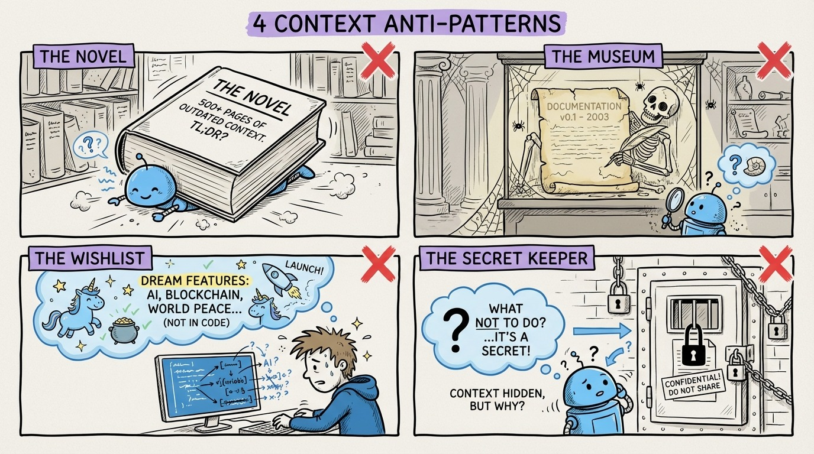

# 13 — 4 Context File Anti-Patterns That Kill Agent Productivity

Your context file is only useful if it's done right. Here are the four ways developers sabotage their own context engineering.

**The Novel.** A 2,000-line context file documenting every class, method, and database table. Models degrade with too much context. Your AGENTS.md should be under 200 lines. Document conventions and decisions, not your entire codebase. The agent can read source code when it needs specifics.

**The Museum.** Written once, never updated. Your project evolves. Your conventions evolve. A stale context file produces stale code. Review it every two weeks. Does it reflect how you actually work today? Update what changed, remove what's obsolete.

**The Wishlist.** Full of aspirational conventions the codebase doesn't follow. "All methods under 20 lines" is useless when your codebase has 100-line methods everywhere. The agent either follows the rule (producing inconsistent code) or follows existing patterns (ignoring your file). Document what IS, not what you wish.

**The Secret Keeper.** Omits negative constraints. What the agent should NOT do is often more important than what it should do. If you've decided against AutoMapper, the agent needs to know. Otherwise it gravitates toward popular patterns from training data.

The fix for all four: start small, stay honest, update regularly, and always include the "don'ts." Your context file should be a living document, not a monument.
