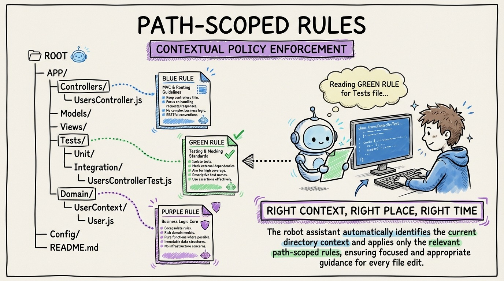

# 14 — Path-Scoped Rules: Surgical Context for Your Codebase

Your AGENTS.md handles project-wide conventions. But different parts of your codebase have different rules. Controllers have different conventions than domain entities. Tests follow different patterns than infrastructure code.

Path-scoped rules solve this. They're modular context files that only load when the agent touches matching files.

In Claude Code, they go in `.claude/rules/` with glob patterns. In Cursor, `.cursor/rules/`. The concept is identical across tools: targeted rules for targeted code.

Example: a controller rule that says "Controllers are thin. Three responsibilities: validate, dispatch via MediatR, map to HTTP response. No business logic. No direct database access." This rule loads only when the agent edits files in `src/Api/Controllers/`.

Example: a test rule that says "Use xUnit, FluentAssertions, NSubstitute. Test name format: MethodName_Scenario_ExpectedResult. Arrange/Act/Assert structure. One behavior per test." Loads only in `tests/`.

The key insight: don't create all your rules upfront. Add them reactively. When the agent writes code that doesn't follow your conventions in a specific area, correct it in review, then create a rule so it never happens again.

This reactive workflow turns every mistake into a permanent improvement. After a few weeks, your context layer becomes comprehensive enough that agents rarely deviate from your standards.
