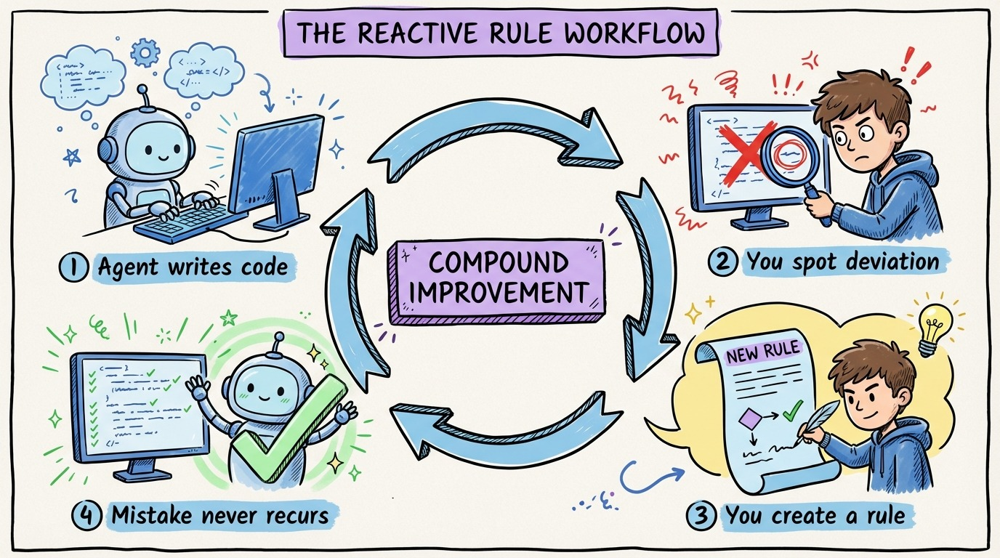

# 15 — The Reactive Rule Workflow

The best context files aren't planned. They're grown.

Here's the workflow that builds a comprehensive context layer without upfront effort:

**Step 1: Agent writes code.** You give it a task. It produces output.

**Step 2: You review and spot a deviation.** The agent used AutoMapper when you use manual mapping. Or it put business logic in a controller. Or it wrote synchronous code when everything should be async.

**Step 3: You fix the code.** Standard review process. Correct what's wrong.

**Step 4: You create a rule.** Write a path-scoped rule (or update AGENTS.md) that prevents this specific mistake from happening again. "Do NOT use AutoMapper. We use manual mapping methods in each handler."

**Step 5: The mistake never recurs.** Next time the agent touches that area, it reads the rule and follows it.

This is a feedback loop that compounds. Every correction becomes a permanent improvement. After 2-3 weeks of active development, your context layer covers 90% of cases because you've captured 90% of the deviations.

The developers who build the best context files don't sit down and write them from scratch. They accumulate them through daily work. Each review session is an opportunity to make every future session better.

Start today. Fix one agent mistake. Write one rule. Repeat tomorrow.
