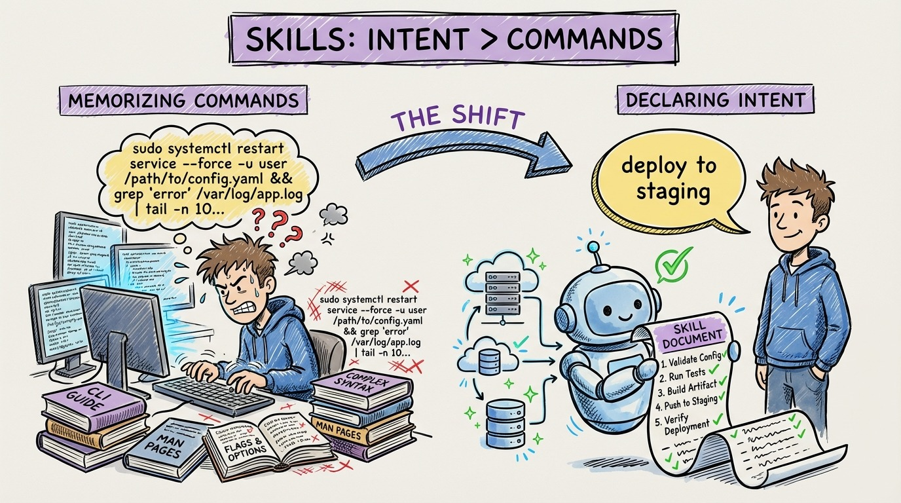

# 16 — Skills: From Memorizing Commands to Declaring Intent

You don't need to remember how to deploy to staging. You don't need to remember the 12-step process for creating a new API endpoint. You don't need to memorize the migration workflow.

Skills are reusable instruction sets that agents invoke on demand. Instead of typing a complex prompt every time, you write the instructions once and the agent uses them whenever they're relevant.

Think of skills as recipes. A deployment skill contains every step: run tests, build the container, push to registry, update the manifest, verify health checks. A new-endpoint skill contains the template: create the controller, handler, validator, DTO, and test file following your exact conventions.

The shift is from imperative to declarative. Old way: you remember the steps and execute them manually (or prompt them from scratch every time). New way: you declare what you want ("deploy this to staging") and the skill handles the how.

Claude Code's skills system lets you create markdown files with instructions and even bash scripts that the agent can execute. Cursor has similar capabilities through its rules system. The tool doesn't matter. The principle does: encode your workflows as reusable context.

The compound effect is significant. Each skill you create eliminates a category of repetitive prompting. After building 10-15 skills, your daily interactions become almost entirely high-level intent ("add pagination to this endpoint") rather than low-level instructions.
