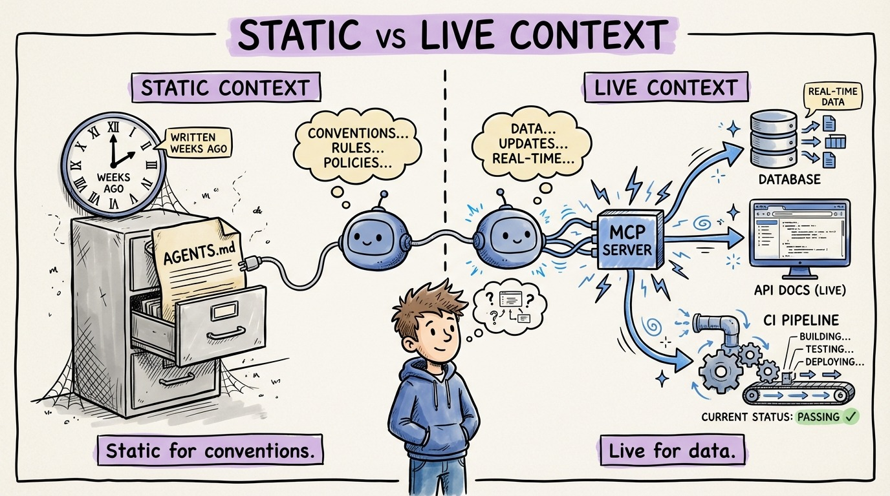

# 17 — MCP Servers: Static Context vs Live Context

Your AGENTS.md is static context. It was true when you wrote it. But what about data that changes every minute? Database schemas. API documentation. Live service health. Deployment status.

MCP (Model Context Protocol) bridges this gap. It gives agents real-time access to external tools and data sources through a standardized interface.

**Static context** (files): Your coding conventions. Architecture decisions. Project structure. Changes rarely. Perfect for AGENTS.md and rule files.

**Live context** (MCP): Your database schema right now. The current state of your CI pipeline. Documentation for the exact version of a library you're using. Changes constantly. Needs real-time access.

An MCP server for your database lets the agent query the actual schema instead of relying on a potentially outdated description in your context file. An MCP server for your documentation lets the agent look up the exact API signature instead of hallucinating one from training data.

The practical setup: MCP servers run locally or on your network. The agent connects to them through a configuration file. When it needs information, it queries the server in real time.

The impact is dramatic for projects with complex dependencies. An agent connected to your database MCP server will never generate a migration that conflicts with the actual schema. An agent connected to your docs MCP server will never use a deprecated API.

Static context for what doesn't change. Live context for what does.
