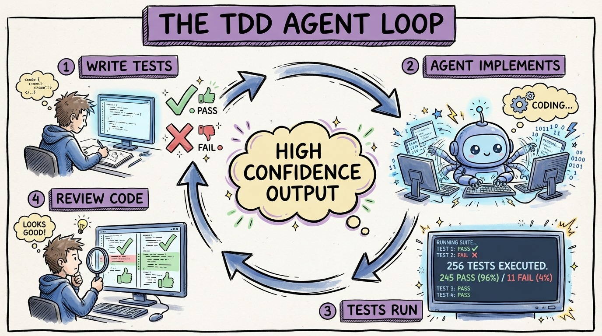

# 18 — The TDD Agent Loop

This is the workflow that changes everything. Write the tests first. Let the agent write the implementation. Verify. Repeat.

The concept is simple. The impact is transformational.

**Step 1: Understand the requirement.** Spend 5 minutes getting clear on what you're building. Write it in plain language. "Free shipping over $100. Standard is $5.99. Express is $12.99. No express to PO boxes."

**Step 2: Write the tests.** All of them. Before any implementation exists. Each test is an unambiguous specification of one behavior. The agent can't misinterpret a test that asserts `result.ShippingCost.Should().Be(0m)`.

**Step 3: Hand the failing tests to the agent.** "Make all these tests pass. Follow the conventions in AGENTS.md." The agent reads the tests, understands the spec, and writes the implementation.

**Step 4: Verify.** Run the tests. If they pass, review the code for quality. If they fail, the agent sees the failure messages and self-corrects.

**Step 5: Review.** The "does it work?" question is already answered by the tests. You focus on "is it clean, secure, and maintainable?"

TDD always made sense but had a cost: writing the code twice. Agents eliminate the second half. You write the spec (tests), the agent writes the implementation. Total time: less than writing just the implementation by hand.

The confidence equation: Spec Clarity x Test Coverage x Context Quality = Output Confidence.
