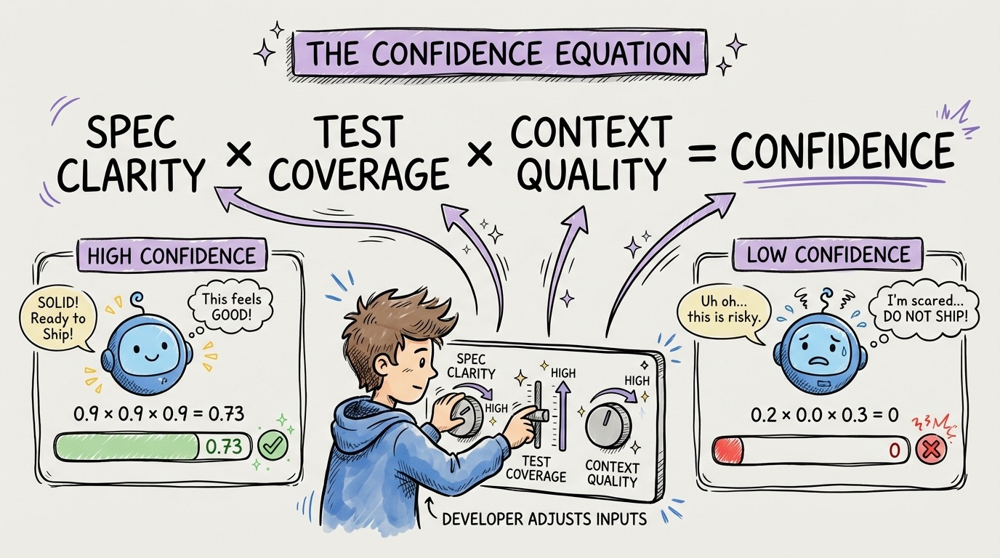

# 19 — The Confidence Equation

How confident can you be in agent-generated code? There's a formula:

**Spec Clarity x Test Coverage x Context Quality = Output Confidence**

Each variable is a multiplier. If any one is zero, confidence is zero regardless of the others.

**Spec Clarity (0-1).** "Build me a REST API" scores 0.2. "Build a REST API with these 5 endpoints, this data model, these validation rules, this error handling behavior, and these authentication requirements" scores 0.9. Vague specs produce code that compiles but doesn't solve your problem.

**Test Coverage (0-1).** No tests: 0. You're trusting the agent's judgment (which, remember, is zero). Comprehensive tests covering happy paths, edge cases, and error scenarios: 0.9. Tests are your automated verification that the code does what you specified.

**Context Quality (0-1).** No context files: 0.3 (the agent still has training data). Well-maintained AGENTS.md with path-scoped rules: 0.9. Context tells the agent HOW to write code that fits your project.

The math is clear. Spec Clarity (0.9) x Test Coverage (0.9) x Context Quality (0.9) = 0.73. That's high confidence. You review for style, not correctness.

Spec Clarity (0.2) x Test Coverage (0) x Context Quality (0.3) = 0. That's vibe coding. You're reviewing everything, trusting nothing.

The investment in each variable pays compound returns. Better specs lead to better tests which lead to better context files which lead to better specs.
