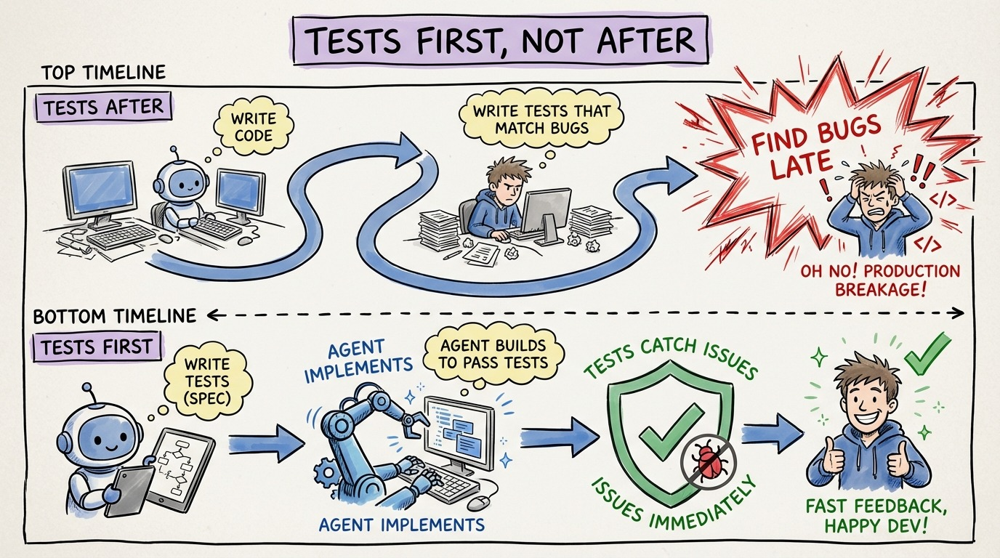

# 20 — Why Tests Come First, Not After

"I'll add tests after the agent writes the code." This is the most dangerous sentence in agentic development.

When you write tests after implementation, you're testing what the code does, not what it should do. Your tests conform to the implementation's behavior, including its bugs. If the agent introduced a subtle off-by-one error, your after-the-fact test will encode that error as expected behavior.

When you write tests first, you're defining the specification. The tests are a contract. The implementation must satisfy the contract, not the other way around.

There's a second reason tests-first wins with agents. An agent that receives failing tests has an unambiguous success criterion. It writes code, runs the tests, sees failures, and iterates. The feedback loop is tight and automated. No human in the loop needed for mechanical corrections.

An agent that receives a vague prompt has no success criterion. It generates code that looks reasonable, but "looks reasonable" and "is correct" are different things. Without tests, you become the test suite. Every review becomes a manual verification of correctness.

The time investment is front-loaded. Writing tests before implementation takes 15-20 minutes per feature. But it saves 30-40 minutes of review, debugging, and rework. The math works even before you factor in the confidence gain.

Simon Willison put it simply: "Code that started from your own specification is a lot less effort to review."
