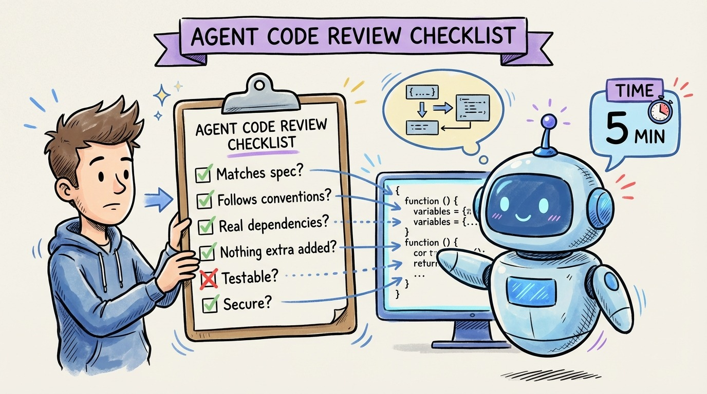

# 21 — The Agent Code Review Checklist

Reviewing agent-generated code requires a different checklist than reviewing human code. Humans make typos and logic errors. Agents make confident architectural mistakes and subtle specification misinterpretations.

**1. Does it match the spec?** Not "does it compile" or "does it look right." Does it actually implement what you specified? Check every requirement against the code. Agents love to implement 90% of the spec perfectly and silently skip the hardest 10%.

**2. Did it follow conventions?** Check against your AGENTS.md. Did it use the right patterns? The right libraries? The right error handling approach? If not, your context file needs updating.

**3. Are there hallucinated dependencies?** Agents sometimes import packages that don't exist or use API methods that were deprecated three versions ago. Verify that every dependency is real and current.

**4. What did it add that you didn't ask for?** Agents are eager to please. They'll add logging, caching, retry logic, and error handling you didn't request. Sometimes helpful. Often over-engineered. Remove what you don't need.

**5. Is it testable?** Even if you wrote tests first, check that the implementation is structured for ongoing testability. No hidden state, no tight coupling, no test-hostile patterns.

**6. Security check.** SQL injection, auth bypass, exposed secrets, missing input validation. Agents don't think adversarially. You must.

Print this list. Use it every time. It takes 5 minutes and catches the mistakes that cost hours.
