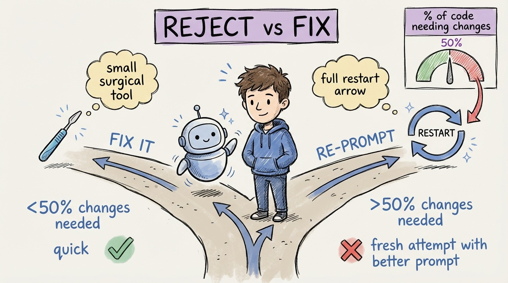

# 22 — When to Reject and Re-prompt vs Fix It Yourself

The agent delivered code that's 70% right. Do you fix the remaining 30% or throw it away and try again?

This decision costs developers more time than any other in agentic development. And most people get it wrong because of the sunk cost trap.

**Re-prompt when:** The approach is wrong, not just the details. The agent used the wrong architectural pattern. It misunderstood the core requirement. The structure doesn't fit your system. Fixing this means rewriting most of the code anyway. A fresh attempt with a clearer prompt will be faster.

**Fix it yourself when:** The approach is right but the details are off. Missing null checks. Wrong variable names. Slightly incorrect business logic. These are surgical fixes that take minutes. Re-prompting would regenerate the entire output, and you'd still need to verify the new version.

**The 50% rule:** If more than 50% of the generated code needs changes, reject and re-prompt. If less than 50%, fix it. This simple threshold prevents the sunk cost trap from eating your time.

**When you re-prompt, improve the prompt.** Don't just retry with the same input. Add the specific constraint the agent missed. "Use the repository pattern, not direct DbContext access." "Return 404 for missing resources, not null." Each failed attempt teaches you what your prompt (or context file) was missing.

The meta-skill: fast, accurate judgment about when the agent's output is salvageable. This comes with practice. After a few weeks, you'll make this call in seconds.
