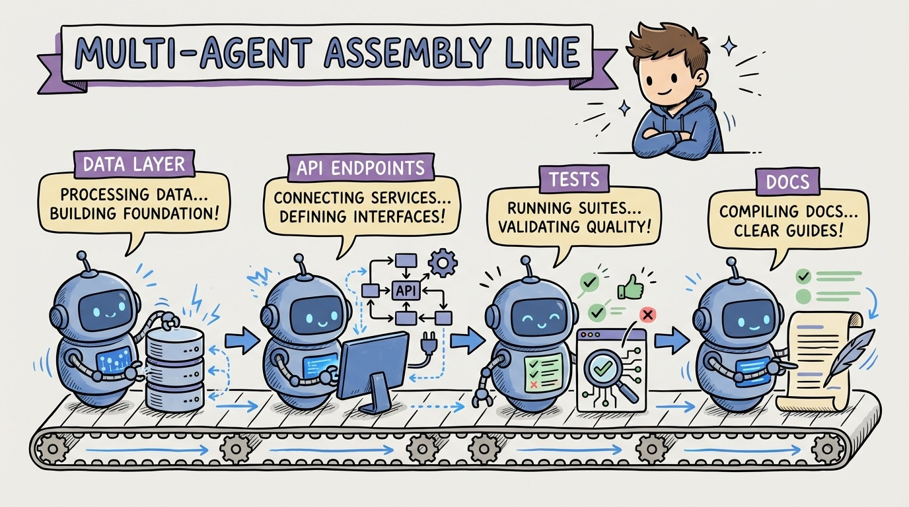

# 23 — Multi-Agent Orchestration: Assembly Line for Code

One agent working one task is useful. Multiple agents working in parallel is transformational.

Think of it as an assembly line. Agent 1 implements the data layer. Agent 2 builds the API endpoints. Agent 3 writes the integration tests. Agent 4 updates the documentation. All simultaneously, all following your specs.

The key is task decomposition. You break a feature into independent pieces that don't touch the same files. Each agent gets a clear scope, its own working directory (git worktree), and a specific set of tests to satisfy.

The orchestration patterns that work:

**Fan-out/fan-in.** Split a feature into 3-5 independent tasks. Launch agents in parallel. Review each output. Merge when all pass review.

**Pipeline.** Agent 1 generates the spec from requirements. Agent 2 implements from the spec. Agent 3 reviews and tests. Each stage's output is the next stage's input.

**Specialist teams.** Different agents for different concerns. A "security agent" reviews every PR for vulnerabilities. A "docs agent" keeps documentation current. A "test agent" ensures coverage stays above threshold.

GitHub reported over a million pull requests created by agents between May and September 2025. The teams behind those PRs weren't using one agent at a time. They were running agent teams.

The bottleneck shifts from "how fast can I code" to "how well can I decompose tasks and review output." That's the director mindset in action.
