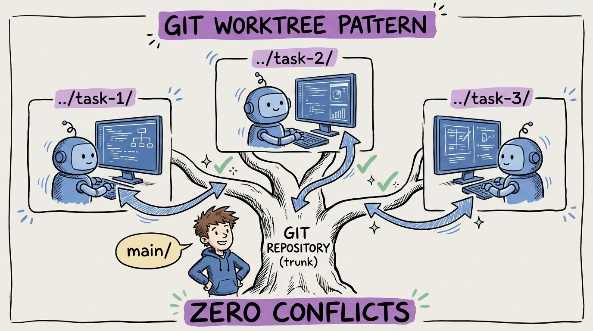

# 24 — The Git Worktree Pattern

The biggest practical problem with parallel agents: they step on each other's files. Agent 1 modifies the database context. Agent 2 modifies the database context. Merge conflict. Wasted work.

Git worktrees solve this cleanly.

A worktree is a separate working directory linked to the same repository. Each worktree has its own branch, its own files, its own state. But they share the same git history.

The workflow: `git worktree add ../feature-auth feature/auth`. Now you have a separate directory for the auth feature. Launch an agent there. Meanwhile, in your main directory, launch another agent on a different feature. Zero conflicts. Independent branches. Clean merges.

**Setup for 3 parallel agents:**
1. `git worktree add ../task-1 -b feature/task-1`
2. `git worktree add ../task-2 -b feature/task-2`
3. `git worktree add ../task-3 -b feature/task-3`

Each agent works in its own directory. Each has its own branch. Your context files (AGENTS.md, rules) are in the repo, so they're automatically available in every worktree.

When agents finish, you review each branch independently and merge them sequentially. If there are conflicts (rare with good task decomposition), you resolve them once during merge.

The overhead is minimal: one command per worktree. The productivity gain is 3-5x throughput. This is how the best teams run agent development at scale.
