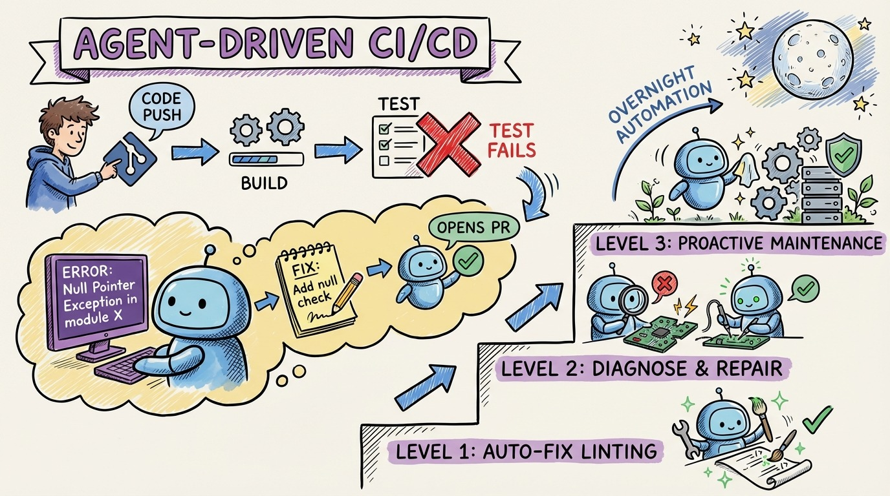

# 25 — Agent-Driven CI/CD: The Fully Automated Pipeline

Your CI pipeline fails. A test broke. A dependency has a vulnerability. A linting rule was violated.

In the old world, a human reads the failure, debugs, fixes, and pushes. In the agent world, the pipeline triggers an agent that reads the failure, diagnoses, fixes, and opens a PR. All while you sleep.

This is agent-driven CI/CD. The pipeline doesn't just detect problems. It fixes them.

**Level 1: Auto-fix known patterns.** Linting failures, formatting issues, simple test fixes. The agent sees the CI output, applies the obvious fix, pushes. No human needed.

**Level 2: Diagnostic and repair.** Failing tests, dependency conflicts, build errors. The agent reads the error, traces the cause, writes a fix, runs the tests locally, and opens a PR for review.

**Level 3: Proactive maintenance.** Dependency updates, security patches, deprecation migrations. The agent monitors for new versions, creates update PRs, runs the full test suite, and flags anything that breaks.

The implementation: GitHub Actions (or your CI) triggers a webhook on failure. The webhook launches an agent with the failure context. The agent works in its own branch and opens a PR.

The key constraint: agents fix and propose. Humans review and merge. The agent never deploys directly to production. That's not automation, that's recklessness. Keep the human in the loop for the final approval.
