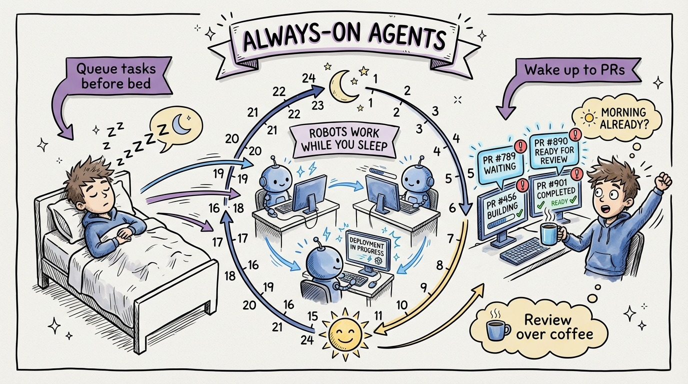

# 26 — Always-On Agents: Your 24/7 Code Maintenance Crew

Background agents don't need your IDE open. You assign a task from your phone, and the agent creates a branch, writes the code, runs the tests, and opens a pull request for your review.

GitHub Copilot Coding Agent, Codex Cloud, Google Jules. These tools turned "fire and forget" into a real workflow.

**The overnight workflow:** Before bed, queue up 3-5 tasks from your backlog. Bug fixes, refactoring tasks, documentation updates, test coverage improvements. Each gets assigned to a background agent. When you wake up, 3-5 PRs are waiting for review.

**The async workflow:** You're in a meeting. A bug report comes in. You assign it to a background agent from your phone. By the time the meeting ends, there's a PR with a fix and passing tests.

**The maintenance workflow:** Set up agents to run weekly. Update dependencies. Check for security vulnerabilities. Ensure test coverage stays above threshold. Generate documentation for new code. The codebase maintains itself.

The economics are compelling. A background agent costs pennies per task in compute. A senior developer costs $80-150 per hour. Even if the agent only handles the mundane 40% of your backlog, you've freed 40% of your most expensive resource for the work that requires human judgment.

The catch: review quality must stay high. The convenience of waking up to PRs is only valuable if you actually review them thoroughly. Rubber-stamping agent PRs is worse than not using agents at all.
