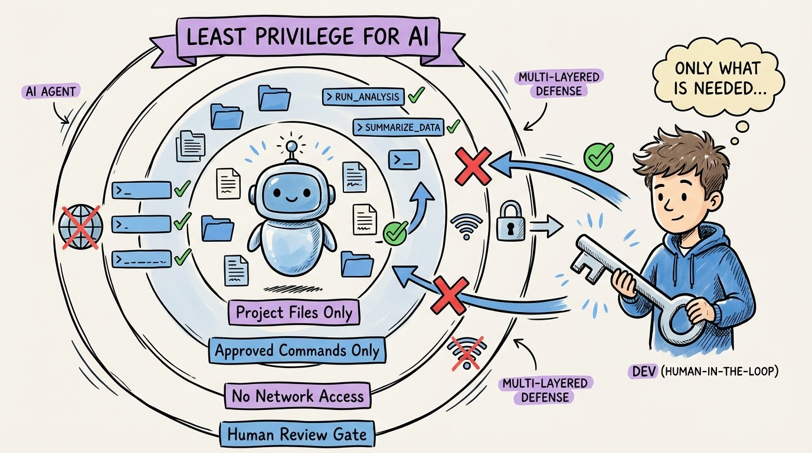

# 27 — Security: Principle of Least Privilege for AI Agents

Your AI agent has access to your codebase, your terminal, your file system, and potentially your cloud infrastructure. That's a lot of trust.

The principle of least privilege applies to agents just like it applies to microservices: give the minimum access needed to complete the task.

**File system access.** Scope agents to the project directory. An agent working on the API layer doesn't need access to your infrastructure-as-code directory. Use allow/deny lists for file paths.

**Command execution.** Agents can run terminal commands. That includes `rm -rf`, `curl` to external URLs, and `git push --force`. Restrict which commands agents can execute. Most tools have permission systems for this.

**Network access.** An agent that can make HTTP requests can exfiltrate code, secrets, or data. Restrict outbound network access to known-good domains (package registries, your CI system).

**Secrets management.** Never put API keys, tokens, or passwords in context files. Use environment variables, secret managers, or vault systems. Agents read context files. Context files should never contain secrets.

**Review before merge.** The ultimate security control. No agent output goes to production without human review. This catches not just security issues but also subtle bugs, architectural violations, and specification mismatches.

The threat model isn't just malicious agents. It's well-intentioned agents making mistakes with powerful access. A typo in a deployment script could take down production. Defense in depth: restrict access, review output, test thoroughly.
