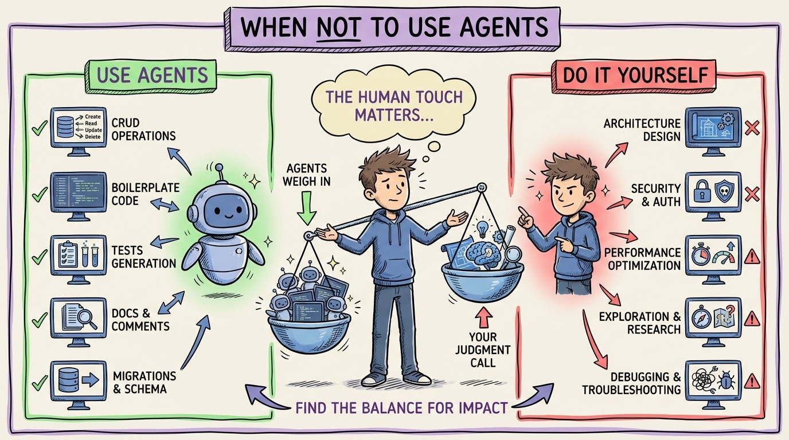

# 28 — The Real Cost of AI Agents (and When NOT to Use One)

Nobody talks about the costs. Not just dollar costs (though those are real), but the hidden costs that make agents the wrong choice for certain tasks.

**Dollar costs.** Running Claude Code or Copilot agent mode burns tokens. A complex feature implementation can cost $5-15 in API calls. Running 3 agents in parallel for a day can easily hit $50-100. At scale across a team, this adds up fast.

**Review costs.** Every line of agent-generated code needs review. If the agent produces 500 lines and you spend 30 minutes reviewing, that's a real cost. Multiply by 5 agent tasks per day.

**Context building costs.** The upfront investment in AGENTS.md, rules, skills, and test suites is real. It pays off over weeks, but the first week is slower, not faster.

**When NOT to use an agent:** Architecture decisions (agents optimize locally, not globally). Security-critical code (agents don't think adversarially). Performance-critical hot paths (agents write correct code, not optimal code). Exploratory coding where you're thinking through a design (the process IS the value). Debugging production issues where you need to understand the "why" deeply.

**When agents shine:** Boilerplate-heavy implementations. CRUD endpoints. Test writing. Documentation. Migrations. Refactoring well-defined patterns. Anything where the spec is clear and the work is mechanical.

The discipline isn't using agents everywhere. It's using them where they help and doing the work yourself where they don't. That judgment call is the skill that separates productive agentic developers from frustrated ones.
