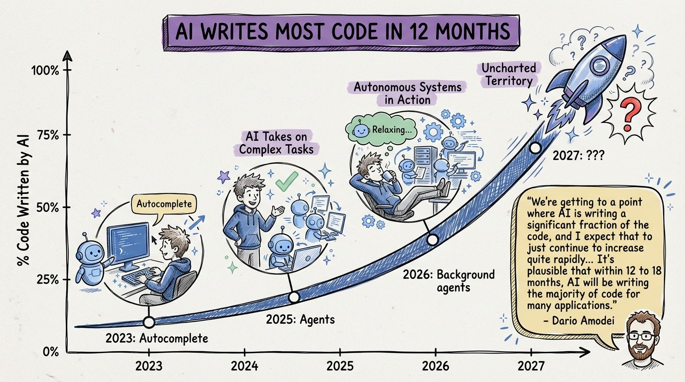

# 29 — The Anthropic Forecast: Most Code Will Be AI-Written in 12 Months

Dario Amodei, CEO of Anthropic, predicted that within 12 months, virtually all code will be written by AI. Not assisted by AI. Written by AI.

This isn't hype from a startup. This is from the company that builds Claude, one of the most capable coding models on the planet. They see the trajectory of their own technology.

The data supports the direction. GitHub reported over a million agent-generated pull requests in just 5 months (May to September 2025). Copilot users show up to 81% productivity improvement in GitHub's data. The trajectory is exponential, not linear.

What does "AI-written" actually mean in practice? Not that developers disappear. It means the implementation step, translating specifications into code, becomes almost entirely automated. Developers become spec writers, reviewers, architects, and orchestrators.

The skills that matter shift from "can you write a binary search" to "can you specify precisely what you need, design systems that are agent-friendly, review code you didn't write, and orchestrate multiple agents effectively."

If this forecast is even directionally correct (and the evidence suggests it is), the developers who invest now in context engineering, TDD loops, and agent orchestration will have a massive head start. Those who dismiss this as hype will be playing catch-up.

The time to adapt is before the shift, not after.
