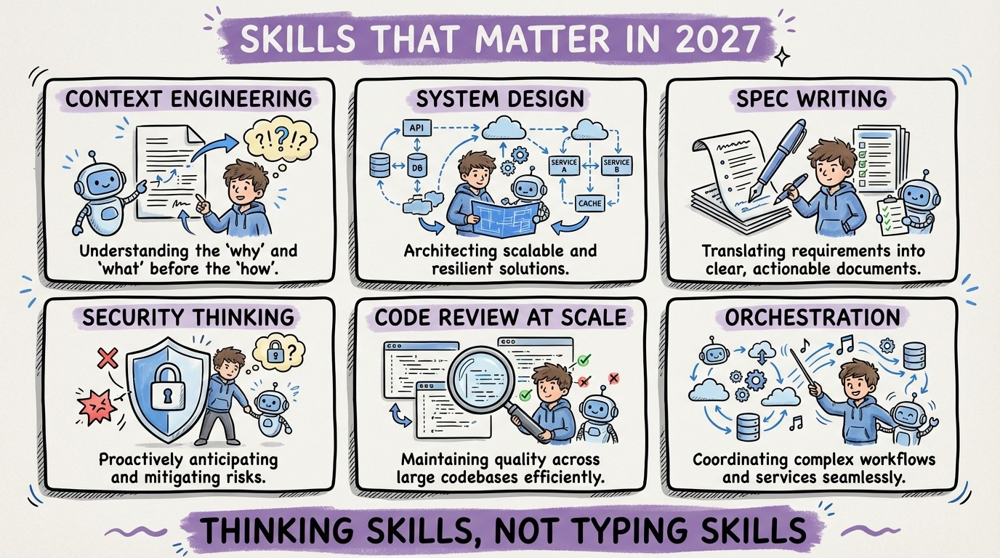

# 30 — The Skills That Will Actually Matter in 2027

If agents write most code by 2027, what skills will companies pay for?

**Context engineering.** The ability to build information layers that make agents productive. AGENTS.md files, rule systems, skills, MCP configurations. This is the new "10x developer" skill. The context engineer who makes an entire team's agents more productive is worth more than any individual coder.

**System design.** Agents implement features. Humans design systems. The ability to think about distributed systems, data flow, failure modes, and scaling is irreplaceable. Agents are bad at global reasoning across system boundaries.

**Specification writing.** Your spec is your product now. The clearer and more precise your specification, the better the output. Technical writing becomes a core engineering skill, not a nice-to-have.

**Security thinking.** Agents don't think adversarially. Someone needs to ask "how could this be exploited?" That requires a human who understands threat models, attack surfaces, and defense in depth.

**Code review at scale.** Reviewing 10x more code than you write. Fast, accurate assessment of correctness, security, and maintainability. Pattern recognition for common agent mistakes.

**Orchestration.** Managing multiple agents, decomposing work, resolving conflicts, maintaining quality across parallel workstreams. Think project management, but for AI teams.

The common thread: all of these are thinking skills, not typing skills. The future belongs to developers who think clearly and communicate precisely. The typing is handled.
