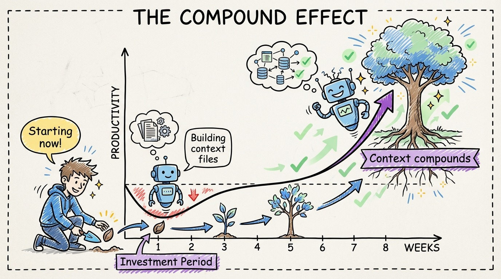

# 31 — The Compound Effect: Every Context File Makes Future Sessions Better

Week 1 with agents is frustrating. You're writing prompts from scratch every time. The agent ignores your conventions. You spend more time correcting than coding.

Week 4 is different. Your AGENTS.md covers the major conventions. Path-scoped rules handle the specifics. You've built 5 skills for common workflows. The agent follows your patterns by default. Reviews are fast.

Week 8 is transformational. New team members (human or AI) read your context files and immediately produce code that fits. Your daily interactions are high-level intent, not low-level instructions. Agent output quality is consistently high.

This is the compound effect. Every context file you write makes every future session more productive. Every rule you add eliminates a category of mistakes. Every skill you create removes a class of repetitive prompting.

The math: if each context file saves 5 minutes per day, and you build 20 context files over a month, you're saving over an hour daily by month's end. That compounds further as each file improves agent output, which reduces review time, which lets you take on more tasks, which creates more opportunities to refine context.

The developers who abandon agents after week 1 ("it doesn't follow my conventions") miss this entirely. They're quitting at the bottom of a J-curve. The investment period is real, but the payoff curve is exponential.

Start small. One file per day. The compound effect does the rest.
