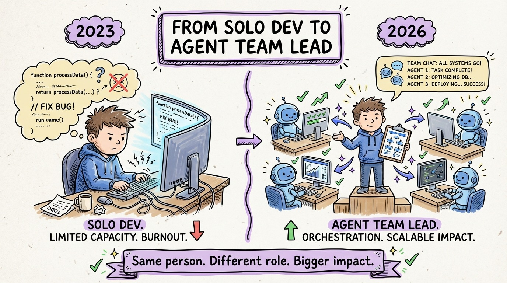

# 32 — From Solo Developer to Agent Team Lead

Your title might still say "software engineer." But your actual job in 2026 is closer to "engineering team lead," where the team happens to be a mix of humans and AI agents.

Think about what a great team lead does. They break down projects into well-scoped tasks. They write clear specifications. They establish coding standards that the team follows. They review pull requests. They make architecture decisions. They mentor juniors on conventions and patterns.

That's exactly what an effective agentic developer does. The "juniors" just happen to run on GPUs instead of coffee.

The skill transfer is direct. **Task decomposition** becomes agent task scoping. **Coding standards** become AGENTS.md and rule files. **Code review** becomes agent output review. **Mentoring** becomes context engineering. **Sprint planning** becomes agent orchestration.

The developers who thrive in this new world aren't necessarily the best coders. They're the best leaders. They're the ones who can hold a complex system in their head, communicate it clearly, break it into pieces, and verify that each piece is correct.

This book gave you the methodology: context engineering, the TDD agent loop, multi-agent orchestration, disciplined review. The tools will keep evolving. New models, new agents, new capabilities every quarter. But the methodology is stable because it's rooted in engineering discipline, not tool-specific tricks.

You're not just a developer anymore. You're the lead of an ever-growing engineering team. Lead well.
